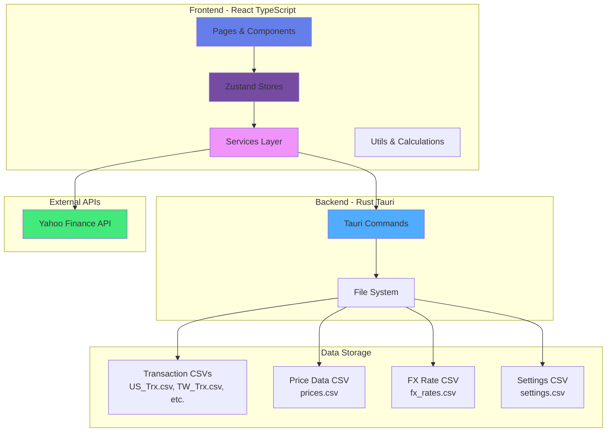

# Portfolio Manager - Development Guide

## Project Overview

Multi-platform portfolio management application for tracking investment transactions across multiple markets (US, Taiwan, Japan, Hong Kong). Built with Clean Architecture principles using Tauri (Rust backend) + React (TypeScript frontend) with privacy-first CSV storage.

## Tech Stack

- **Frontend**: React 18 + TypeScript + Vite + Zustand (state management)
- **Backend**: Rust + Tauri v1.5
- **Styling**: styled-components (NO Tailwind CSS)
- **Charts**: Recharts and lightweight-charts v5
- **Tables**: TanStack Table (via AdvancedTable component)
- **Data Format**: CSV files
- **Storage**: File-based (Tauri app data directory)
- **Testing**: Vitest
- **Platform**: Desktop (macOS, Windows, Linux)

## Core Features

### 1. **Dashboard** 📊
- Real-time portfolio valuation with cached price data
- Position tracking with gain/loss calculations
- Daily gain/loss tracking (compares today vs yesterday)
- Currency breakdown with donut chart visualization
- Top 5 positions bar chart
- Sortable columns (click header to sort asc/desc)
- Filters: Search by ticker, filter by currency, show gainers/losers (daily)
- Heatmap visualization for portfolio allocation

### 2. **Reports** 📈
- **Positions**: Detailed positions table with filtering and sorting
- **Heatmaps**: TradingView-style visual charts for portfolio allocation and top positions

### 3. **Transaction Management** 💼
- View all transactions across all markets
- Transaction statistics by type (Buy/Sell/Dividend/Split)
- Transaction statistics by currency (USD/TWD/JPY/HKD)
- Filterable and sortable data table
- Search by stock, type, or date
- Filter by currency and transaction type

### 4. **Data Management** 📥
- **Historical Data Download**: Yahoo Finance integration for stock prices and FX rates
- **Batch Processing**: Efficient bulk downloads with rate limiting (100ms delays)
- **Data Readiness**: Track historical data coverage and gaps
- **Currency Data**: FX rate management and visualization
- **Progress Tracking**: Real-time download progress and status updates

### 5. **Settings** ⚙️
- **Key Settings**: Base currency selection (USD/TWD/JPY/HKD)
- **Data Readiness**: Historical data download triggers and status tracking
- **Currency Data**: FX rate management and visualization
- **NAV Management**: Net Asset Value data handling

## Architecture Overview



## Complete Data Flow Overview

### 1. **Transaction Input & Loading**
- **User Data Entry**: User places CSV files in `desktop/data/`:
  - `US_Trx.csv`, `TW_Trx.csv`, `JP_Trx.csv`, `HK_Trx.csv`
- **Loading Flow**:
  ```
  Dashboard/Report/TransactionsPage
  → transactionsStore.loadTransactions()
  → transactionService.loadTransactions()
  → Tauri backend (read_csv command)
  → File system reads all market CSVs
  → transactionService parses & transforms
  → transactionsStore stores transactions[]
  ```

### 2. **Portfolio Calculation Flow**
- **Triggered by**: Loading positions on Dashboard or Report pages
- **Steps**:
  1. Load transactions from transactionsStore
  2. Calculate positions using `portfolioCalculations.ts`:
     - Group transactions by stock
     - Apply stock splits
     - Calculate cost basis & average cost
  3. Load cached prices via `priceDataService.loadAllPrices()`
  4. Update positions with current prices: `currentValue = shares × latestPrice`
  5. Load FX rates via `fxRateDataService.loadAllRates()`
  6. Convert all values to base currency using FX rate map
  7. Calculate portfolio summary (total value, gains/losses, currency breakdown)

### 3. **Price Data Download & Caching**
- **User Action**: Click "Download Historical Data" on DataReadinessPage
- **Flow**:
  ```
  User
  → DataReadinessPage
  → historicalDataService.downloadHistoricalData(symbols, dateRange)
  → Yahoo Finance API (fetch OHLC data)
  → priceDataService.savePrices(records):
     - Read existing prices.csv via Tauri
     - Merge new + existing data (avoid duplicates)
     - Write merged data back to prices.csv
  → Update cache
  ```

### 4. **FX Rate Management**
- **Sources**: Yahoo Finance API, stored in `fx_rates.csv` cache
- **Flow**:
  ```
  historicalFxService
  → Yahoo Finance (fetch rates for currency pairs)
  → fxRateDataService.saveFxRates()
  → Merge with existing fx_rates.csv
  → Store in app data cache
  ```
- **Usage**: Convert all currencies to USD internally, then to base currency (set in settings)

### 5. **Stock Detail Page - NAV & Price Analysis**
- **Data Sources**:
  - Transaction history for selected stock
  - Historical prices (from cache)
  - NAV (Net Asset Value) data
  - Split events & dividend history

- **Chart Data Calculation**:
  ```
  Stock transactions
  → Calculate position history (running shares)
  → Fetch historical prices for date range
  → Calculate position value at each date
  → Merge with NAV series data
  → Display multi-axis chart (price vs NAV vs share count)
  ```

### 6. **Dividend Tracking & Summary**
- **Data Collection**:
  - Filter transactions by type = "Dividend"
  - Group by period (yearly/quarterly)
  - Count distributions per period
  - Sum amounts per period

- **Display**:
  - Summary metrics (total, count, average, last date, annual yield)
  - Histogram chart showing distribution history
  - Summary table: Period | Count | Amount (right-aligned)

### 7. **Settings Persistence**
- **Flow**:
  ```
  SettingsPage (KeySettingsPage/DataReadinessPage/etc.)
  → settingsStore.updateSettings()
  → settingsService.saveSetting(key, value)
  → Tauri backend writes to settings.csv (key,value format)
  ```
- **Persisted Settings**: Base currency, UI preferences

### 8. **Data Storage Structure**
```
~/Library/Application Support/com.kfpun.portfolio/data/
├── User Input (gitignored):
│   ├── US_Trx.csv        # User transaction uploads
│   ├── TW_Trx.csv
│   ├── JP_Trx.csv
│   └── HK_Trx.csv
├── Cache Files (auto-managed):
│   ├── prices.csv        # Merged historical prices
│   ├── fx_rates.csv      # Cached exchange rates
│   ├── settings.csv      # App settings (key,value)
│   ├── dividends/        # Per-symbol dividend files
│   ├── navs/             # Per-symbol NAV data
│   ├── splits/           # Per-symbol split data
│   └── yahoo_metas/      # Per-symbol metadata
```

### 9. **State Management Dependencies**

| Store | Purpose | Key Data | Depends On |
|-------|---------|----------|-----------|
| `portfolioStore` | Portfolio calculations & positions | positions[], summary, fxRates | transactionsStore |
| `transactionsStore` | Transaction data & statistics | transactions[], stats | transactionService |
| `settingsStore` | User preferences | baseCurrency, settings | settingsService |
| `stockDetailStore` | Stock detail page data | priceHistory, navHistory, events | services |
| `currencyStore` | UI currency filter | selectedCurrency | (independent) |
| `navigationStore` | Current page navigation | currentPage | (independent) |

### 10. **Data Transformation Pipeline**

```
Raw CSV Data
  ↓
Tauri (read_csv command)
  ↓
transactionService (parse + transform)
  ↓
Zustand Store (normalized state)
  ↓
Utils (calculations: positions, summaries)
  ↓
Components (formatted display)
  ↓
User Interface
```

### 11. **Rate Limiting & Error Handling**
- **Applied to**: Yahoo Finance API calls
- **Implementation**: 100ms sleep between API calls in Rust backend
- **Benefits**: Prevents API throttling, graceful degradation
- **Retry Logic**: Exponential backoff with configurable max retries

## Component Guidelines

### Chart Library (lightweight-charts v5)

**CRITICAL**: Always use lightweight-charts v5 API syntax:

```typescript
import { createChart, AreaSeries, LineSeries, HistogramSeries } from 'lightweight-charts';

const chart = createChart(container, options);

// v5 API - use addSeries with series type
const areaSeries = chart.addSeries(AreaSeries, { /* options */ });
const lineSeries = chart.addSeries(LineSeries, { /* options */ });
const histogramSeries = chart.addSeries(HistogramSeries, { /* options */ });
```

**DO NOT** use v4 API:
```typescript
// ❌ WRONG - v4 API (deprecated)
chart.addAreaSeries();
chart.addLineSeries();
chart.addHistogramSeries();
```

### Table Components

**ALWAYS** use the reusable `AdvancedTable` component for data tables:

```typescript
import { AdvancedTable, Column } from '../components/AdvancedTable';

const columns: Column<DataType>[] = [
  {
    key: 'field1',
    header: 'Column Name',
    accessor: (row) => row.field1,
    sortable: true,
    align: 'left',
  },
];

<AdvancedTable
  data={dataArray}
  columns={columns}
  defaultSortKey="field1"
  defaultSortDirection="asc"
/>
```

**DO NOT** create custom `<table>` elements with styled-components unless there's a specific design requirement that AdvancedTable cannot handle.

## Project Structure (Detailed)

```
portfolio/
├── desktop/
│   ├── src/                        # Frontend (Clean Architecture)
│   │   ├── components/             # Presentation Layer
│   │   │   ├── ApiCreditsBar.tsx   # (REMOVED) API credits display
│   │   │   ├── CurrencySelector.tsx # Currency dropdown
│   │   │   ├── DataTable.tsx       # Filterable/sortable table
│   │   │   ├── Navigation.tsx      # App navigation bar
│   │   │   ├── PageLayout.tsx      # Common page layout
│   │   │   ├── SettingsLayout.tsx  # Settings page layout
│   │   │   ├── StatsCards.tsx      # Statistics cards
│   │   │   └── ui/
│   │   │       └── button.tsx      # Button component
│   │   │
│   │   ├── pages/                  # Page Components
│   │   │   ├── PortfolioPage.tsx   # Portfolio dashboard
│   │   │   ├── TransactionsPage.tsx # Transaction history
│   │   │   ├── HeatmapPage.tsx     # Portfolio heatmap
│   │   │   ├── SettingsPage.tsx    # Settings container
│   │   │   ├── KeySettingsPage.tsx # Currency settings
│   │   │   ├── DataReadinessPage.tsx # Data download UI
│   │   │   └── CurrencyDataPage.tsx  # FX data download UI
│   │   │
│   │   ├── services/               # Infrastructure Layer
│   │   │   ├── transactionService.ts    # Transaction CRUD
│   │   │   ├── settingsService.ts       # Settings persistence
│   │   │   ├── priceService.ts          # Price cache reader
│   │   │   ├── priceDataService.ts      # Price CSV operations
│   │   │   ├── fxRateDataService.ts     # FX rate CSV operations
│   │   │   ├── historicalDataService.ts # Yahoo Finance price downloader
│   │   │   └── historicalFxService.ts   # Yahoo Finance FX downloader
│   │   │
│   │   ├── store/                  # State Management (Zustand)
│   │   │   ├── portfolioStore.ts   # Portfolio state
│   │   │   ├── transactionsStore.ts # Transactions state
│   │   │   ├── settingsStore.ts    # Settings state
│   │   │   ├── currencyStore.ts    # Currency filter state
│   │   │   └── navigationStore.ts  # Navigation state
│   │   │
│   │   ├── types/                  # Type Definitions
│   │   │   ├── Transaction.ts      # Transaction & Stats types
│   │   │   ├── Settings.ts         # Settings types
│   │   │   ├── Portfolio.ts        # Position & Summary types
│   │   │   ├── PriceData.ts        # Price record types
│   │   │   ├── FxRateData.ts       # FX rate record types
│   │   │   └── HistoricalData.ts   # Historical data types
│   │   │
│   │   ├── utils/                  # Utility Functions
│   │   │   ├── transactionStats.ts # Stats calculations
│   │   │   ├── portfolioCalculations.ts # P&L & position calcs
│   │   │   ├── csvUtils.ts         # CSV parsing utilities
│   │   │   └── rateLimiter.ts      # Rate limiting & backoff
│   │   │
│   │   ├── App.tsx                 # App shell with routing
│   │   ├── main.tsx                # React entry point
│   │   └── styles.css              # Global styles
│   │
│   ├── src-tauri/                  # Backend (Rust)
│   │   ├── src/
│   │   │   └── main.rs             # Tauri commands
│   │   ├── Cargo.toml              # Rust dependencies
│   │   └── tauri.conf.json         # Tauri configuration
│   │
│   ├── data/                       # User data (gitignored)
│   │   ├── US_Trx.csv              # US transactions
│   │   ├── TW_Trx.csv              # Taiwan transactions
│   │   ├── JP_Trx.csv              # Japan transactions
│   │   ├── HK_Trx.csv              # Hong Kong transactions
│   │   ├── prices.csv              # Cached price data
│   │   ├── fx_rates.csv            # Cached FX rates
│   │   └── settings.csv            # App settings
│   │
│   ├── tests/                      # Test Files
│   │   ├── utils/
│   │   │   ├── csvUtils.test.ts
│   │   │   ├── transactionStats.test.ts
│   │   │   └── portfolioCalculations.test.ts
│   │   ├── services/
│   │   │   ├── transactionService.test.ts
│   │   │   └── settingsService.test.ts
│   │   ├── portfolioStore.test.ts
│   │   ├── transactionsStore.test.ts
│   │   ├── settingsStore.test.ts
│   │   ├── priceDataService.test.ts
│   │   └── rateLimiter.test.ts
│   │
│   ├── package.json                # Frontend dependencies
│   ├── vite.config.ts              # Vite configuration
│   └── vitest.config.ts            # Vitest configuration
│
├── CLAUDE.md                       # This file
├── README.md                       # Project documentation
└── requirements.md                 # Requirements specification
```

## Clean Architecture Layers

### 1. Presentation Layer (`components/`, `pages/`)
- **Responsibility**: UI components, user interaction
- **Files**:
  - `PortfolioPage.tsx` - Portfolio dashboard with charts
  - `TransactionsPage.tsx` - Transaction history table
  - `HeatmapPage.tsx` - Portfolio allocation heatmap
  - `SettingsPage.tsx` - Settings container
  - `DataTable.tsx` - Reusable filterable/sortable table
  - `Navigation.tsx` - App navigation
- **Rules**: Only imports from stores, types, and styled-components

### 2. Application Layer (`store/`)
- **Responsibility**: State management, side effects
- **Files**:
  - `portfolioStore.ts` - Portfolio state & calculations
  - `transactionsStore.ts` - Transaction state
  - `settingsStore.ts` - Settings state
  - `currencyStore.ts` - Currency filter state
  - `navigationStore.ts` - Navigation state
- **Rules**: Calls services, manages global state

### 3. Domain Layer (`types/`, `utils/`)
- **Responsibility**: Business logic, data models
- **Files**:
  - `types/Transaction.ts` - Transaction & Stats types
  - `types/Settings.ts` - Settings types
  - `types/Portfolio.ts` - Position & Summary types
  - `utils/transactionStats.ts` - Statistics calculations
  - `utils/portfolioCalculations.ts` - Position & P&L calculations
  - `utils/csvUtils.ts` - CSV parsing utilities
- **Rules**: Pure functions, no external dependencies

### 4. Infrastructure Layer (`services/`)
- **Responsibility**: External communication (Tauri, Yahoo Finance, CSV storage)
- **Files**:
  - `transactionService.ts` - Tauri backend for transactions
  - `settingsService.ts` - Tauri backend for settings
  - `priceService.ts` - Price cache reader
  - `priceDataService.ts` - Price CSV operations
  - `fxRateDataService.ts` - FX rate CSV operations
  - `historicalDataService.ts` - Yahoo Finance downloader
  - `historicalFxService.ts` - FX rate downloader
- **Rules**: Handles invoke calls, error handling, data transformation

## Key Features in Detail

### Portfolio Dashboard

**Features**:
- Real-time portfolio valuation using cached price data
- Position tracking with shares, cost basis, current value
- Gain/loss calculations (total and daily)
- Currency breakdown with donut chart
- Top 5 positions bar chart
- Daily change tracking (compares current price vs yesterday)

**Filters**:
- Search by ticker symbol
- Filter by currency (USD/TWD/JPY/HKD/All)
- Show gainers only (daily gain > 0)
- Show losers only (daily gain < 0)

**Sorting**:
- Click any column header to sort
- Toggle between ascending/descending

**Daily Gain/Loss Calculation**:
```typescript
dailyGainLoss = (todayPrice - yesterdayPrice) * shares
dailyGainLossPercent = ((todayPrice - yesterdayPrice) / yesterdayPrice) * 100
```

### Transactions Management

**Features**:
- View all transactions across all markets
- Transaction statistics:
  - By type: Buy, Sell, Dividend, Split
  - By currency: USD, TWD, JPY, HKD
- Filterable and sortable data table

**Filters**:
- Search by stock symbol, type, or date
- Filter by currency
- Filter by transaction type

**Sorting**:
- Sort by date, stock, type, quantity, price, fees

### Historical Data Download

**Features**:
- Download historical stock prices from Yahoo Finance
- Download historical FX rates from Yahoo Finance
- Bulk download manager for multiple symbols
- Data readiness tracking
- Split data support

**Data Sources**:
- Yahoo Finance API for stock prices
- Yahoo Finance API for FX rates
- Rate limiting with exponential backoff

**Storage**:
- Prices stored in individual CSV files: `prices/{symbol}.csv`
- FX rates stored in: `fx_rates/{from}_{to}.csv`
- Split data stored in: `splits/{symbol}.csv`

### Settings

**Features**:
- Base currency selection (USD/TWD/JPY/HKD)
- Data management interface
- Historical data download triggers

**Storage**:
- Settings stored in CSV file: `settings.csv`
- Format: `key,value`

## Data Models

### Transaction
```typescript
interface Transaction {
  date: string;              // YYYY-MM-DD
  stock: string;             // Ticker symbol
  type: string;              // Buy, Sell, Dividend, Split
  quantity: string;          // Number of shares
  price: string;             // Price per share
  fees: string;              // Transaction fees
  split_ratio: string;       // Split ratio (e.g., "2" for 2:1 split)
  currency: string;          // USD, TWD, JPY, HKD
}
```

### Position
```typescript
interface Position {
  stock: string;
  currency: string;
  shares: number;
  averageCost: number;
  totalCost: number;
  currentPrice?: number;
  currentValue?: number;
  gainLoss?: number;
  gainLossPercent?: number;
  lastUpdated?: string;
}
```

### PriceRecord
```typescript
interface PriceRecord {
  symbol: string;
  date: string;
  close: number;
  open?: number;
  high?: number;
  low?: number;
  volume?: number;
  source: 'manual' | 'yahoo_finance';
  updated_at: string;
}
```

### FxRateRecord
```typescript
interface FxRateRecord {
  from_currency: string;
  to_currency: string;
  date: string;
  rate: number;
  source: 'yahoo_finance' | 'manual';
  updated_at: string;
}
```

## CSV File Formats

### Transaction CSV (US_Trx.csv, etc.)
```csv
date,stock,transaction_type,quantity,price,fees,split_ratio,currency
2024-01-15,AAPL,Buy,10,150.25,1.5,1,USD
2024-02-20,AAPL,Sell,5,160.50,1.2,1,USD
```

### Price Data CSV (prices.csv)
```csv
symbol,date,close,open,high,low,volume,source,updated_at
AAPL,2024-12-03,180.25,178.50,181.00,177.80,52340100,yahoo_finance,2024-12-04T10:00:00.000Z
```

### FX Rate CSV (fx_rates.csv)
```csv
from_currency,to_currency,date,rate,source,updated_at
TWD,USD,2024-12-03,0.0312,yahoo_finance,2024-12-04T10:00:00.000Z
```

### Settings CSV (settings.csv)
```csv
key,value
baseCurrency,USD
```

## Tauri Commands

### Backend Commands (Rust)

```rust
// Read all transaction CSVs and combine them
read_csv() -> Result<String, String>

// Get a setting value by key
get_setting(key: String) -> Result<String, String>

// Save a setting value
set_setting(key: String, value: String) -> Result<(), String>

// Read a data CSV file (prices, fx_rates, etc.)
read_data_csv(filename: String) -> Result<String, String>

// Write to a data CSV file (overwrites)
write_data_csv(filename: String, content: String) -> Result<(), String>

// Append to a data CSV file
append_data_csv(filename: String, content: String) -> Result<(), String>

// Read historical price file for a symbol
read_price_file(symbol: String) -> Result<String, String>

// Write historical price file for a symbol
write_price_file(symbol: String, content: String) -> Result<(), String>

// Read FX rate file for a currency pair
read_fx_rate_file(pair: String) -> Result<String, String>

// Write FX rate file for a currency pair
write_fx_rate_file(pair: String, content: String) -> Result<(), String>

// Read split file for a symbol
read_split_file(symbol: String) -> Result<String, String>

// Write split file for a symbol
write_split_file(symbol: String, content: String) -> Result<(), String>
```

## Development Commands

```bash
# Install dependencies
cd desktop
npm install

# Development mode (hot reload)
npm run tauri:dev

# Type checking
npm run lint

# Run tests
npm test

# Production build
npm run tauri:build
```

## Testing

- **Framework**: Vitest
- **Test Files**: 10 test files
- **Total Tests**: 78 tests
- **Coverage**:
  - Utils: csvUtils, transactionStats, portfolioCalculations, rateLimiter
  - Services: transactionService, settingsService, priceDataService
  - Stores: portfolioStore, transactionsStore, settingsStore

## Code Conventions

### File Naming
- Components: PascalCase (e.g., `PortfolioPage.tsx`)
- Services: camelCase (e.g., `transactionService.ts`)
- Stores: camelCase with Store suffix (e.g., `portfolioStore.ts`)
- Types: PascalCase (e.g., `Transaction.ts`)
- Utils: camelCase (e.g., `csvUtils.ts`)

### Component Structure
```typescript
// 1. Imports
import { useState } from 'react';
import styled from 'styled-components';
import { YourType } from '../types/YourType';
import { useYourStore } from '../store/yourStore';

// 2. Styled components
const Container = styled.div`
  // styles
`;

// 3. Component
export function YourComponent() {
  // Stores
  const { data } = useYourStore();

  // State
  const [state, setState] = useState('');

  // Handlers
  const handleClick = () => {};

  // Render
  return <Container>...</Container>;
}
```

### Service Structure
```typescript
// 1. Imports
import { invoke } from '@tauri-apps/api/tauri';
import { YourType } from '../types/YourType';

// 2. Service class
export class YourService {
  async loadData(): Promise<YourType> {
    const result = await invoke<string>('your_command');
    return JSON.parse(result);
  }
}

// 3. Singleton export
export const yourService = new YourService();
```

### Store Structure (Zustand)
```typescript
// 1. Imports
import { create } from 'zustand';
import { YourType } from '../types/YourType';
import { yourService } from '../services/yourService';

// 2. Interface
interface YourState {
  data: YourType | null;
  loading: boolean;
  error: string | null;
  loadData: () => Promise<void>;
}

// 3. Store
export const useYourStore = create<YourState>((set) => ({
  data: null,
  loading: false,
  error: null,

  loadData: async () => {
    set({ loading: true, error: null });
    try {
      const data = await yourService.loadData();
      set({ data, loading: false });
    } catch (err) {
      set({
        error: err instanceof Error ? err.message : 'Error',
        loading: false,
      });
    }
  },
}));
```

## Styling Guidelines

### Use styled-components (NOT Tailwind)

```typescript
// Good
const Card = styled.div`
  padding: 2rem;
  border-radius: 12px;
`;

// Bad - DO NOT USE
<div className="p-8 rounded-xl">
```

### Color Palette

**Currency Colors**:
- USD: `#2563eb` (blue)
- TWD: `#dc2626` (red)
- JPY: `#16a34a` (green)
- HKD: `#fb923c` (orange)

**Transaction Type Colors**:
- Buy: `#16a34a` (green)
- Sell: `#dc2626` (red)
- Dividend: `#2563eb` (blue)
- Split: `#f59e0b` (amber)

**UI Colors**:
- Primary gradient: `linear-gradient(135deg, #667eea 0%, #764ba2 100%)`
- Background: `radial-gradient(circle at top, #ede9fe 0%, #f8fafc 60%)`
- Success: `#10b981`
- Error: `#ef4444`
- Warning: `#f59e0b`

## Git Commit Format

```
type: description of change

# Types:
# - fix: bug fixes
# - feat: new features
# - refactor: code refactoring
# - test: adding tests
# - docs: documentation updates
- chore: maintenance tasks

# Examples:
fix: fix daily gain/loss filter calculation
feat: add historical data download
refactor: extract CSV utilities
test: add portfolio calculation tests
```

**Rules**:
- Use lowercase for type prefix
- No "Claude Code" or AI attribution in commits
- Remove trailing spaces
- Be concise and clear
- One logical change per commit

## Security & Best Practices

### Data Security
- ✅ All sensitive data stored in OS-specific app data directory
- ✅ CSV files gitignored
- ✅ File permissions managed by OS
- ✅ No API keys in code

### Code Quality
- ✅ TypeScript strict mode enabled
- ✅ All tests passing (78 tests)
- ✅ No console errors in production
- ✅ Error boundaries for graceful failures
- ✅ Rate limiting for external API calls

### Performance
- ✅ Cached price data for offline use
- ✅ Lazy loading for heavy components
- ✅ Memoized calculations
- ✅ Efficient CSV parsing with PapaParse

## Troubleshooting

### Build Errors
- **Rust errors**: Check `Cargo.toml` dependencies
- **TypeScript errors**: Run `npm run lint`
- **Import errors**: Check file paths and exports

### Data Not Loading
1. Check CSV files in `data/` directory
2. Verify Tauri commands are registered
3. Check browser console for errors
4. Verify file permissions

### Tests Failing
1. Run `npm test` to see failures
2. Check mock setup in test files
3. Verify imports are correct
4. Check for async/await issues

### Chart Rendering Issues
1. Clear browser cache and dev server cache (delete `.vite` folder)
2. Restart dev server (`npm run dev`)
3. Verify lightweight-charts methods use correct API (addAreaSeries, addLineSeries, etc)
4. Check that series data is properly formatted with required fields

## Future Enhancements

- [ ] Real-time price updates (WebSocket)
- [ ] Multi-currency portfolio view
- [ ] Tax reporting features
- [ ] Export to PDF/Excel
- [ ] Mobile app (iOS/Android)
- [ ] Cloud sync
- [ ] Multiple portfolios support
- [ ] Dividend tracking calendar
- [ ] Performance analytics
- [ ] Automated backup
- [ ] Advanced charting options (Bollinger Bands, Moving Averages)
