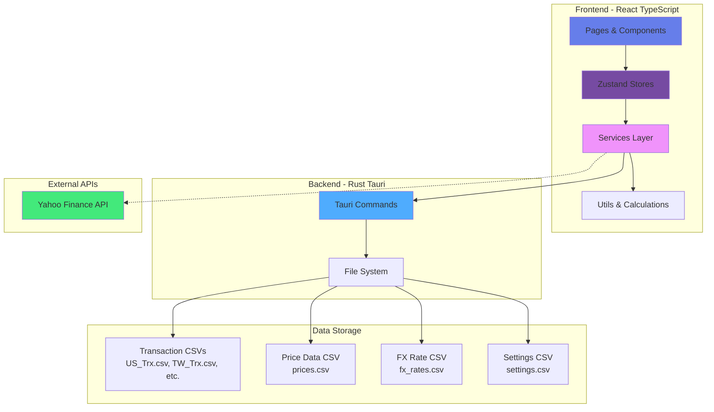
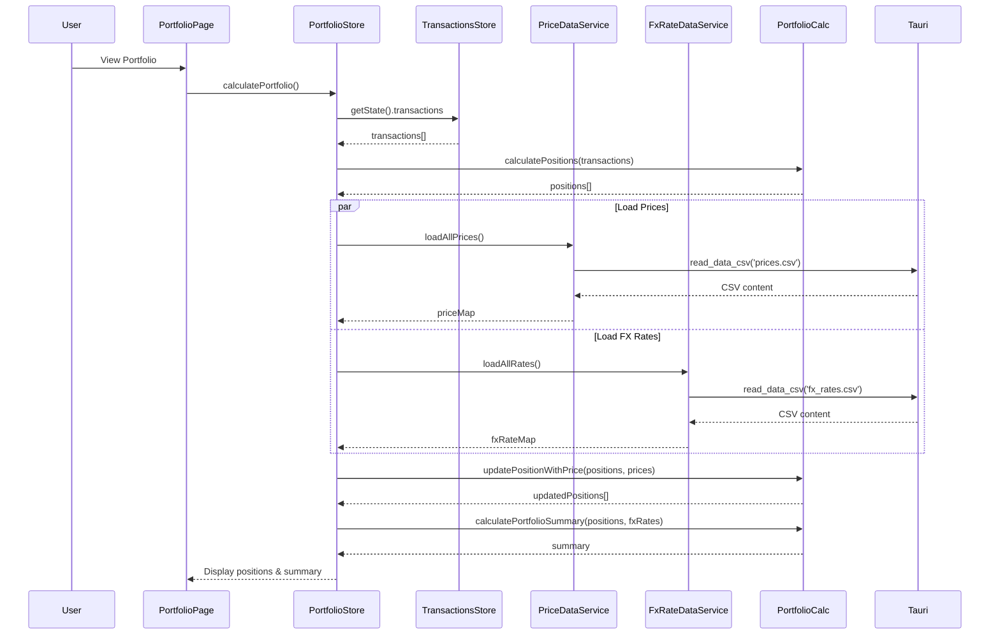
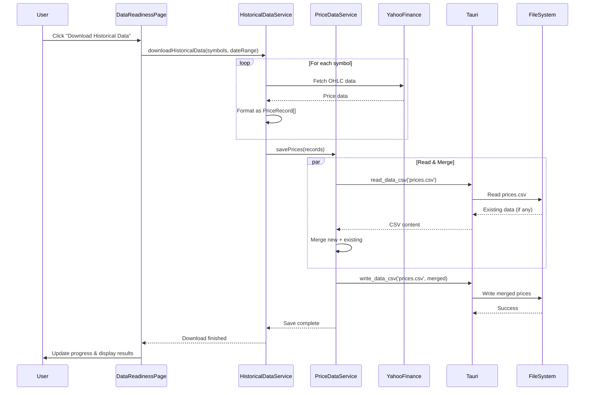
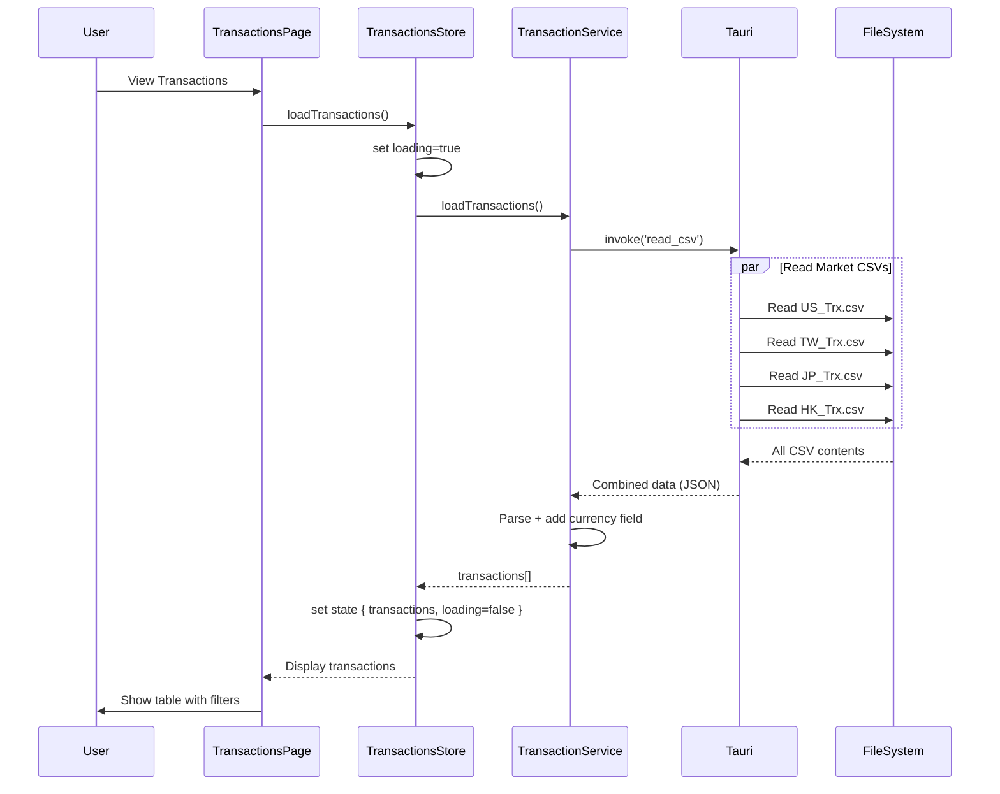

# Portfolio Manager - Development Guide

## Project Overview

Multi-platform portfolio management application for tracking investment transactions across multiple markets (US, Taiwan, Japan, Hong Kong). Built with Clean Architecture principles using Tauri (Rust backend) + React (TypeScript frontend) with styled-components.

## Tech Stack

- **Frontend**: React 18 + TypeScript + Vite + Zustand (state management)
- **Backend**: Rust + Tauri v1.5
- **Styling**: styled-components (NO Tailwind CSS)
- **Icons**: lucide-react
- **Charts**: Recharts and lightweight-charts v5
- **Tables**: TanStack Table (via AdvancedTable component)
- **Data Format**: CSV files
- **Storage**: File-based (Tauri app data directory)
- **Testing**: Vitest
- **Platform**: Desktop (macOS, Windows, Linux)

## Component Guidelines

### Chart Library (lightweight-charts v5)

**CRITICAL**: Always use lightweight-charts v5 API syntax:

```typescript
import { createChart, AreaSeries, LineSeries, HistogramSeries } from 'lightweight-charts';

const chart = createChart(container, options);

// v5 API - use addSeries with series type
const areaSeries = chart.addSeries(AreaSeries, { /* options */ });
const lineSeries = chart.addSeries(LineSeries, { /* options */ });
const histogramSeries = chart.addSeries(HistogramSeries, { /* options */ });
```

**DO NOT** use v4 API:
```typescript
// ❌ WRONG - v4 API (deprecated)
chart.addAreaSeries();
chart.addLineSeries();
chart.addHistogramSeries();
```

### Table Components

**ALWAYS** use the reusable `AdvancedTable` component for data tables:

```typescript
import { AdvancedTable, Column } from '../components/AdvancedTable';

const columns: Column<DataType>[] = [
  {
    key: 'field1',
    header: 'Column Name',
    accessor: (row) => row.field1,
    sortable: true,
    align: 'left',
  },
];

<AdvancedTable
  data={dataArray}
  columns={columns}
  defaultSortKey="field1"
  defaultSortDirection="asc"
/>
```

**DO NOT** create custom `<table>` elements with styled-components unless there's a specific design requirement that AdvancedTable cannot handle.

## Features Overview

### 1. **Dashboard** 📊
- Real-time portfolio valuation with cached price data
- Position tracking with gain/loss calculations
- Daily gain/loss tracking (compares today vs yesterday)
- Currency breakdown with donut chart visualization
- Top 5 positions bar chart
- Sortable columns (click header to sort asc/desc)
- Filters: Search by ticker, filter by currency, show gainers/losers (daily)
- Heatmap visualization for portfolio allocation

### 2. **Report** 📈
- **Positions**: Detailed positions table with filtering and sorting
- **Heatmaps**: Visual charts for portfolio allocation and top positions

### 3. **Transactions Management** 📝
- View all transactions across all markets
- Transaction statistics by type (Buy/Sell/Dividend/Split)
- Transaction statistics by currency (USD/TWD/JPY/HKD)
- Filterable and sortable data table
- Search by stock, type, or date
- Filter by currency and transaction type

### 4. **Settings** ⚙️
- **Key Settings**: Base currency selection (USD/TWD/JPY/HKD)
- **Data Readiness**: Historical data download triggers and status tracking
- **Currency Data**: FX rate management and visualization
- **NAV Management**: Net Asset Value data handling

### 5. **Data Visualization** 📈
- Heatmap showing portfolio allocation by position
- Currency allocation donut chart
- Top positions bar chart
- Daily gain/loss indicators

## Architecture Overview



## Complete Data Flow Overview

### 1. **Transaction Input & Loading**
- **User Data Entry**: User places CSV files in `desktop/data/`:
  - `US_Trx.csv`, `TW_Trx.csv`, `JP_Trx.csv`, `HK_Trx.csv`
- **Loading Flow**:
  ```
  Dashboard/Report/TransactionsPage 
  → transactionsStore.loadTransactions() 
  → transactionService.loadTransactions() 
  → Tauri backend (read_csv command) 
  → File system reads all market CSVs
  → transactionService parses & transforms 
  → transactionsStore stores transactions[]
  ```

### 2. **Portfolio Calculation Flow**
- **Triggered by**: Loading positions on Dashboard or Report pages
- **Steps**:
  1. Load transactions from transactionsStore
  2. Calculate positions using `portfolioCalculations.ts`:
     - Group transactions by stock
     - Apply stock splits
     - Calculate cost basis & average cost
  3. Load cached prices via `priceDataService.loadAllPrices()`
  4. Update positions with current prices: `currentValue = shares × latestPrice`
  5. Load FX rates via `fxRateDataService.loadAllRates()`
  6. Convert all values to base currency using FX rate map
  7. Calculate portfolio summary (total value, gains/losses, currency breakdown)

### 3. **Price Data Download & Caching**
- **User Action**: Click "Download Historical Data" on DataReadinessPage
- **Flow**:
  ```
  User 
  → DataReadinessPage 
  → historicalDataService.downloadHistoricalData(symbols, dateRange)
  → Yahoo Finance API (fetch OHLC data)
  → priceDataService.savePrices():
     - Read existing prices.csv via Tauri
     - Merge new + existing data (avoid duplicates)
     - Write merged data back to prices.csv
  → Update cache
  ```

### 4. **FX Rate Management**
- **Sources**: Yahoo Finance API, stored in `fx_rates.csv` cache
- **Flow**:
  ```
  historicalFxService 
  → Yahoo Finance (fetch rates for currency pairs)
  → fxRateDataService.saveFxRates()
  → Merge with existing fx_rates.csv
  → Store in app data cache
  ```
- **Usage**: Convert all currencies to USD internally, then to base currency (set in settings)

### 5. **Stock Detail Page - NAV & Price Analysis**
- **Data Sources**:
  - Transaction history for selected stock
  - Historical prices (from cache)
  - NAV (Net Asset Value) data
  - Split events & dividend history
  
- **Chart Data Calculation**:
  ```
  Stock transactions 
  → Calculate position history (running shares)
  → Fetch historical prices for date range
  → Calculate position value at each date
  → Merge with NAV series data
  → Display multi-axis chart (price vs NAV vs share count)
  ```

### 6. **Dividend Tracking & Summary**
- **Data Collection**:
  - Filter transactions by type = "Dividend"
  - Group by period (yearly/quarterly)
  - Count distributions per period
  - Sum amounts per period
  
- **Display**:
  - Summary metrics (total, count, average, last date, annual yield)
  - Histogram chart showing distribution history
  - Summary table: Period | Count | Amount (right-aligned)

### 7. **Settings Persistence**
- **Flow**:
  ```
  SettingsPage (KeySettingsPage/DataReadinessPage/etc.) 
  → settingsStore.updateSettings()
  → settingsService.saveSetting(key, value)
  → Tauri backend writes to settings.csv (key,value format)
  ```
- **Persisted Settings**: Base currency, UI preferences

### 8. **Data Storage Structure**
```
~/Library/Application Support/com.kfpun.portfolio/data/
├── User Input (gitignored):
│   ├── US_Trx.csv        # User transaction uploads
│   ├── TW_Trx.csv
│   ├── JP_Trx.csv
│   └── HK_Trx.csv
├── Cache Files (auto-managed):
│   ├── prices.csv        # Merged historical prices
│   ├── fx_rates.csv      # Cached exchange rates
│   ├── settings.csv      # App settings (key,value)
│   ├── dividends/        # Per-symbol dividend files
│   ├── navs/             # Per-symbol NAV data
│   ├── splits/           # Per-symbol split data
│   └── yahoo_metas/      # Per-symbol metadata
```

### 9. **State Management Dependencies**

| Store | Purpose | Key Data | Depends On |
|-------|---------|----------|-----------|
| `portfolioStore` | Portfolio calculations & positions | positions[], summary, fxRates | transactionsStore |
| `transactionsStore` | Transaction data & statistics | transactions[], stats | transactionService |
| `settingsStore` | User preferences | baseCurrency, settings | settingsService |
| `stockDetailStore` | Stock detail page data | priceHistory, navHistory, events | services |
| `currencyStore` | UI currency filter | selectedCurrency | (independent) |
| `navigationStore` | Current page navigation | currentPage | (independent) |

### 10. **Data Transformation Pipeline**

```
Raw CSV Data 
  ↓
Tauri (read_csv command)
  ↓
transactionService (parse + transform)
  ↓
Zustand Store (normalized state)
  ↓
Utils (calculations: positions, summaries)
  ↓
Components (formatted display)
  ↓
User Interface
```

### 11. **Rate Limiting & Error Handling**
- **Applied to**: Yahoo Finance API calls
- **Implementation**: `rateLimiter.ts` utility with exponential backoff
- **Benefits**: Prevents API throttling, graceful degradation
- **Retry Logic**: Exponential backoff with configurable max retries

## Data Flow Diagrams

### Portfolio Calculation Flow



### Historical Data Download Flow



### Transaction Loading Flow



## Project Structure (Detailed)

```
portfolio/
├── desktop/
│   ├── src/                        # Frontend (Clean Architecture)
│   │   ├── components/             # Presentation Layer
│   │   │   ├── ApiCreditsBar.tsx   # (REMOVED) API credits display
│   │   │   ├── CurrencySelector.tsx # Currency dropdown
│   │   │   ├── DataTable.tsx       # Filterable/sortable table
│   │   │   ├── Navigation.tsx      # App navigation bar
│   │   │   ├── PageLayout.tsx      # Common page layout
│   │   │   ├── SettingsLayout.tsx  # Settings page layout
│   │   │   ├── StatsCards.tsx      # Statistics cards
│   │   │   └── ui/
│   │   │       └── button.tsx      # Button component
│   │   │
│   │   ├── pages/                  # Page Components
│   │   │   ├── PortfolioPage.tsx   # Portfolio dashboard
│   │   │   ├── TransactionsPage.tsx # Transaction history
│   │   │   ├── HeatmapPage.tsx     # Portfolio heatmap
│   │   │   ├── SettingsPage.tsx    # Settings container
│   │   │   ├── KeySettingsPage.tsx # Currency settings
│   │   │   ├── DataReadinessPage.tsx # Data download UI
│   │   │   └── CurrencyDataPage.tsx  # FX data download UI
│   │   │
│   │   ├── services/               # Infrastructure Layer
│   │   │   ├── transactionService.ts    # Transaction CRUD
│   │   │   ├── settingsService.ts       # Settings persistence
│   │   │   ├── priceService.ts          # Price cache reader
│   │   │   ├── priceDataService.ts      # Price CSV operations
│   │   │   ├── fxRateDataService.ts     # FX rate CSV operations
│   │   │   ├── historicalDataService.ts # Yahoo Finance price downloader
│   │   │   └── historicalFxService.ts   # Yahoo Finance FX downloader
│   │   │
│   │   ├── store/                  # State Management (Zustand)
│   │   │   ├── portfolioStore.ts   # Portfolio state
│   │   │   ├── transactionsStore.ts # Transactions state
│   │   │   ├── settingsStore.ts    # Settings state
│   │   │   ├── currencyStore.ts    # Currency filter state
│   │   │   └── navigationStore.ts  # Navigation state
│   │   │
│   │   ├── types/                  # Type Definitions
│   │   │   ├── Transaction.ts      # Transaction & Stats types
│   │   │   ├── Settings.ts         # Settings types
│   │   │   ├── Portfolio.ts        # Position & Summary types
│   │   │   ├── PriceData.ts        # Price record types
│   │   │   ├── FxRateData.ts       # FX rate record types
│   │   │   └── HistoricalData.ts   # Historical data types
│   │   │
│   │   ├── utils/                  # Utility Functions
│   │   │   ├── transactionStats.ts # Stats calculations
│   │   │   ├── portfolioCalculations.ts # P&L & position calcs
│   │   │   ├── csvUtils.ts         # CSV parsing utilities
│   │   │   └── rateLimiter.ts      # Rate limiting & backoff
│   │   │
│   │   ├── App.tsx                 # App shell with routing
│   │   ├── main.tsx                # React entry point
│   │   └── styles.css              # Global styles
│   │
│   ├── src-tauri/                  # Backend (Rust)
│   │   ├── src/
│   │   │   └── main.rs             # Tauri commands
│   │   ├── Cargo.toml              # Rust dependencies
│   │   └── tauri.conf.json         # Tauri configuration
│   │
│   ├── data/                       # User data (gitignored)
│   │   ├── US_Trx.csv              # US transactions
│   │   ├── TW_Trx.csv              # Taiwan transactions
│   │   ├── JP_Trx.csv              # Japan transactions
│   │   ├── HK_Trx.csv              # Hong Kong transactions
│   │   ├── prices.csv              # Cached price data
│   │   ├── fx_rates.csv            # Cached FX rates
│   │   └── settings.csv            # App settings
│   │
│   ├── tests/                      # Test Files
│   │   ├── utils/
│   │   │   ├── csvUtils.test.ts
│   │   │   ├── transactionStats.test.ts
│   │   │   └── portfolioCalculations.test.ts
│   │   ├── services/
│   │   │   ├── transactionService.test.ts
│   │   │   └── settingsService.test.ts
│   │   ├── portfolioStore.test.ts
│   │   ├── transactionsStore.test.ts
│   │   ├── settingsStore.test.ts
│   │   ├── priceDataService.test.ts
│   │   └── rateLimiter.test.ts
│   │
│   ├── package.json                # Frontend dependencies
│   ├── vite.config.ts              # Vite configuration
│   └── vitest.config.ts            # Vitest configuration
│
├── CLAUDE.md                       # This file
├── README.md                       # Project documentation
└── requirements.md                 # Requirements specification
```

## Clean Architecture Layers

### 1. Presentation Layer (`components/`, `pages/`)
- **Responsibility**: UI components, user interaction
- **Files**:
  - `PortfolioPage.tsx` - Portfolio dashboard with charts
  - `TransactionsPage.tsx` - Transaction history table
  - `HeatmapPage.tsx` - Portfolio allocation heatmap
  - `SettingsPage.tsx` - Settings container
  - `DataTable.tsx` - Reusable filterable/sortable table
  - `Navigation.tsx` - App navigation
- **Rules**: Only imports from stores, types, and styled-components

### 2. Application Layer (`store/`)
- **Responsibility**: State management, side effects
- **Files**:
  - `portfolioStore.ts` - Portfolio state & calculations
  - `transactionsStore.ts` - Transaction state
  - `settingsStore.ts` - Settings state
  - `currencyStore.ts` - Currency filter state
  - `navigationStore.ts` - Navigation state
- **Rules**: Calls services, manages global state

### 3. Domain Layer (`types/`, `utils/`)
- **Responsibility**: Business logic, data models
- **Files**:
  - `types/Transaction.ts` - Transaction & Stats types
  - `types/Settings.ts` - Settings types
  - `types/Portfolio.ts` - Position & Summary types
  - `utils/transactionStats.ts` - Statistics calculations
  - `utils/portfolioCalculations.ts` - Position & P&L calculations
  - `utils/csvUtils.ts` - CSV parsing utilities
- **Rules**: Pure functions, no external dependencies

### 4. Infrastructure Layer (`services/`)
- **Responsibility**: External communication (Tauri, Yahoo Finance, CSV storage)
- **Files**:
  - `transactionService.ts` - Tauri backend for transactions
  - `settingsService.ts` - Tauri backend for settings
  - `priceService.ts` - Price cache reader
  - `priceDataService.ts` - Price CSV operations
  - `fxRateDataService.ts` - FX rate CSV operations
  - `historicalDataService.ts` - Yahoo Finance downloader
  - `historicalFxService.ts` - FX rate downloader
- **Rules**: Handles invoke calls, error handling, data transformation

## Key Features in Detail

### Portfolio Dashboard

**Features**:
- Real-time portfolio valuation using cached price data
- Position tracking with shares, cost basis, current value
- Gain/loss calculations (total and daily)
- Currency breakdown with donut chart
- Top 5 positions bar chart
- Daily change tracking (compares current price vs yesterday)

**Filters**:
- Search by ticker symbol
- Filter by currency (USD/TWD/JPY/HKD/All)
- Show gainers only (daily gain > 0)
- Show losers only (daily gain < 0)

**Sorting**:
- Click any column header to sort
- Toggle between ascending/descending

**Daily Gain/Loss Calculation**:
```typescript
dailyGainLoss = (todayPrice - yesterdayPrice) * shares
dailyGainLossPercent = ((todayPrice - yesterdayPrice) / yesterdayPrice) * 100
```

### Transactions Management

**Features**:
- View all transactions across all markets
- Transaction statistics:
  - By type: Buy, Sell, Dividend, Split
  - By currency: USD, TWD, JPY, HKD
- Filterable and sortable data table

**Filters**:
- Search by stock symbol, type, or date
- Filter by currency
- Filter by transaction type

**Sorting**:
- Sort by date, stock, type, quantity, price, fees

### Historical Data Download

**Features**:
- Download historical stock prices from Yahoo Finance
- Download historical FX rates from Yahoo Finance
- Bulk download manager for multiple symbols
- Data readiness tracking
- Split data support

**Data Sources**:
- Yahoo Finance API for stock prices
- Yahoo Finance API for FX rates
- Rate limiting with exponential backoff

**Storage**:
- Prices stored in individual CSV files: `prices/{symbol}.csv`
- FX rates stored in: `fx_rates/{from}_{to}.csv`
- Split data stored in: `splits/{symbol}.csv`

### Settings

**Features**:
- Base currency selection (USD/TWD/JPY/HKD)
- Data management interface
- Historical data download triggers

**Storage**:
- Settings stored in CSV file: `settings.csv`
- Format: `key,value`

## Data Models

### Transaction
```typescript
interface Transaction {
  date: string;              // YYYY-MM-DD
  stock: string;             // Ticker symbol
  type: string;              // Buy, Sell, Dividend, Split
  quantity: string;          // Number of shares
  price: string;             // Price per share
  fees: string;              // Transaction fees
  split_ratio: string;       // Split ratio (e.g., "2" for 2:1 split)
  currency: string;          // USD, TWD, JPY, HKD
}
```

### Position
```typescript
interface Position {
  stock: string;
  currency: string;
  shares: number;
  averageCost: number;
  totalCost: number;
  currentPrice?: number;
  currentValue?: number;
  gainLoss?: number;
  gainLossPercent?: number;
  lastUpdated?: string;
}
```

### PriceRecord
```typescript
interface PriceRecord {
  symbol: string;
  date: string;
  close: number;
  open?: number;
  high?: number;
  low?: number;
  volume?: number;
  source: 'manual' | 'yahoo_finance';
  updated_at: string;
}
```

### FxRateRecord
```typescript
interface FxRateRecord {
  from_currency: string;
  to_currency: string;
  date: string;
  rate: number;
  source: 'yahoo_finance' | 'manual';
  updated_at: string;
}
```

## CSV File Formats

### Transaction CSV (US_Trx.csv, etc.)
```csv
date,stock,transaction_type,quantity,price,fees,split_ratio,currency
2024-01-15,AAPL,Buy,10,150.25,1.5,1,USD
2024-02-20,AAPL,Sell,5,160.50,1.2,1,USD
```

### Price Data CSV (prices.csv)
```csv
symbol,date,close,open,high,low,volume,source,updated_at
AAPL,2024-12-03,180.25,178.50,181.00,177.80,52340100,yahoo_finance,2024-12-04T10:00:00.000Z
```

### FX Rate CSV (fx_rates.csv)
```csv
from_currency,to_currency,date,rate,source,updated_at
TWD,USD,2024-12-03,0.0312,yahoo_finance,2024-12-04T10:00:00.000Z
```

### Settings CSV (settings.csv)
```csv
key,value
baseCurrency,USD
```

## Tauri Commands

### Backend Commands (Rust)

```rust
// Read all transaction CSVs and combine them
read_csv() -> Result<String, String>

// Get a setting value by key
get_setting(key: String) -> Result<String, String>

// Save a setting value
set_setting(key: String, value: String) -> Result<(), String>

// Read a data CSV file (prices, fx_rates, etc.)
read_data_csv(filename: String) -> Result<String, String>

// Write to a data CSV file (overwrites)
write_data_csv(filename: String, content: String) -> Result<(), String>

// Append to a data CSV file
append_data_csv(filename: String, content: String) -> Result<(), String>

// Read historical price file for a symbol
read_price_file(symbol: String) -> Result<String, String>

// Write historical price file for a symbol
write_price_file(symbol: String, content: String) -> Result<(), String>

// Read FX rate file for a currency pair
read_fx_rate_file(pair: String) -> Result<String, String>

// Write FX rate file for a currency pair
write_fx_rate_file(pair: String, content: String) -> Result<(), String>

// Read split file for a symbol
read_split_file(symbol: String) -> Result<String, String>

// Write split file for a symbol
write_split_file(symbol: String, content: String) -> Result<(), String>
```

## Development Commands

```bash
# Install dependencies
cd desktop
npm install

# Development mode (hot reload)
npm run tauri:dev

# Type checking
npm run lint

# Run tests
npm test

# Production build
npm run tauri:build
```

## Testing

- **Framework**: Vitest
- **Test Files**: 10 test files
- **Total Tests**: 78 tests
- **Coverage**:
  - Utils: csvUtils, transactionStats, portfolioCalculations, rateLimiter
  - Services: transactionService, settingsService, priceDataService
  - Stores: portfolioStore, transactionsStore, settingsStore

## Code Conventions

### File Naming
- Components: PascalCase (e.g., `PortfolioPage.tsx`)
- Services: camelCase (e.g., `transactionService.ts`)
- Stores: camelCase with Store suffix (e.g., `portfolioStore.ts`)
- Types: PascalCase (e.g., `Transaction.ts`)
- Utils: camelCase (e.g., `csvUtils.ts`)

### Component Structure
```typescript
// 1. Imports
import { useState } from 'react';
import styled from 'styled-components';
import { YourType } from '../types/YourType';
import { useYourStore } from '../store/yourStore';

// 2. Styled components
const Container = styled.div`
  // styles
`;

// 3. Component
export function YourComponent() {
  // Stores
  const { data } = useYourStore();

  // State
  const [state, setState] = useState('');

  // Handlers
  const handleClick = () => {};

  // Render
  return <Container>...</Container>;
}
```

### Service Structure
```typescript
// 1. Imports
import { invoke } from '@tauri-apps/api/tauri';
import { YourType } from '../types/YourType';

// 2. Service class
export class YourService {
  async loadData(): Promise<YourType> {
    const result = await invoke<string>('your_command');
    return JSON.parse(result);
  }
}

// 3. Singleton export
export const yourService = new YourService();
```

### Store Structure (Zustand)
```typescript
// 1. Imports
import { create } from 'zustand';
import { YourType } from '../types/YourType';
import { yourService } from '../services/yourService';

// 2. Interface
interface YourState {
  data: YourType | null;
  loading: boolean;
  error: string | null;
  loadData: () => Promise<void>;
}

// 3. Store
export const useYourStore = create<YourState>((set) => ({
  data: null,
  loading: false,
  error: null,

  loadData: async () => {
    set({ loading: true, error: null });
    try {
      const data = await yourService.loadData();
      set({ data, loading: false });
    } catch (err) {
      set({
        error: err instanceof Error ? err.message : 'Error',
        loading: false,
      });
    }
  },
}));
```

## Styling Guidelines

### Use styled-components (NOT Tailwind)

```typescript
// Good
const Card = styled.div`
  padding: 2rem;
  border-radius: 12px;
`;

// Bad - DO NOT USE
<div className="p-8 rounded-xl">
```

### Color Palette

**Currency Colors**:
- USD: `#2563eb` (blue)
- TWD: `#dc2626` (red)
- JPY: `#16a34a` (green)
- HKD: `#fb923c` (orange)

**Transaction Type Colors**:
- Buy: `#16a34a` (green)
- Sell: `#dc2626` (red)
- Dividend: `#2563eb` (blue)
- Split: `#f59e0b` (amber)

**UI Colors**:
- Primary gradient: `linear-gradient(135deg, #667eea 0%, #764ba2 100%)`
- Background: `radial-gradient(circle at top, #ede9fe 0%, #f8fafc 60%)`
- Success: `#10b981`
- Error: `#ef4444`
- Warning: `#f59e0b`

## Git Commit Format

```
type: description of change

# Types:
# - fix: bug fixes
# - feat: new features
# - refactor: code refactoring
# - test: adding tests
# - docs: documentation updates
# - chore: maintenance tasks

# Examples:
fix: fix daily gain/loss filter calculation
feat: add historical data download
refactor: extract CSV utilities
test: add portfolio calculation tests
```

**Rules**:
- Use lowercase for type prefix
- No "Claude Code" or AI attribution in commits
- Remove trailing spaces
- Be concise and clear
- One logical change per commit

## Security & Best Practices

### Data Security
- ✅ All sensitive data stored in OS-specific app data directory
- ✅ CSV files gitignored
- ✅ File permissions managed by OS
- ✅ No API keys in code

### Code Quality
- ✅ TypeScript strict mode enabled
- ✅ All tests passing (78 tests)
- ✅ No console errors in production
- ✅ Error boundaries for graceful failures
- ✅ Rate limiting for external API calls

### Performance
- ✅ Cached price data for offline use
- ✅ Lazy loading for heavy components
- ✅ Memoized calculations
- ✅ Efficient CSV parsing with PapaParse

## CSV Data Flow Architecture

### Overview

The application uses CSV files as the primary data storage mechanism. Data flows through multiple layers:

```
Frontend (TypeScript) 
    ↓ (invoke Tauri command)
Rust Backend (Tauri) 
    ↓ (read/write)
File System (CSV files)
    ↑ (read)
Rust Backend (parse)
    ↑ (send back)
Frontend (parse & type convert)
    ↓
Zustand Store (normalized state)
    ↓
Components (render)
```

### Data Files Structure

| File | Purpose | Location | Format |
|------|---------|----------|--------|
| `prices_*.csv` | Historical price data per symbol | `data/prices/` | date, close, open, high, low, volume, source, updated_at |
| `fx_rates.csv` | Foreign exchange rates | `data/fx_rates/` | date, from_currency, to_currency, rate, source, updated_at |
| `navs_*.csv` | NAV data per fund symbol | `data/navs/` | date, nav, updated_at |
| `dividends_*.csv` | Dividend history per symbol | `data/dividends/` | ex_date, amount, currency, updated_at |
| `settings.csv` | App settings | `data/` | key, value |
| `securities.csv` | Security master data | `data/` | ticker, name, exchange, currency, type, sector |

### Current Data Flow Patterns

#### 1. **Reading Price Data**

```typescript
// Frontend: priceDataService.ts
async readSymbolPrices(symbol: string) {
  const content = await invoke<string>('read_price_file', { symbol });
  return this.parsePriceFile(symbol, content); // Parse CSV string
}

// Flow:
// 1. Frontend calls Tauri command with symbol
// 2. Rust reads prices_SYMBOL.csv from disk
// 3. Returns CSV string to frontend
// 4. Frontend parses with PapaParse
// 5. Converts string values to typed PriceRecord[]
// 6. Stores in Zustand portfolioStore.prices
// 7. Components use typed data
```

**Current Implementation**:
- Service: `desktop/src/services/priceDataService.ts`
- Rust Command: `read_price_file(symbol)` in `main.rs`
- Parse: `parseCSV()` utility with PapaParse
- Type Conversion: Manual field mapping in `parsePriceFile()`
- Caching: No client-side cache (re-parses on each read)

#### 2. **Writing Price Data (Yahoo Finance Download)**

```typescript
// Frontend: historicalDataService.ts
async downloadPrices(symbols: string[]) {
  await invoke('download_stock_data', { symbols });
}

// Flow:
// 1. Frontend triggers download via Tauri command
// 2. Rust fetches from Yahoo Finance API
// 3. Rust builds CSV content with Polars DataFrame
// 4. Rust merges with existing prices_SYMBOL.csv (append new dates)
// 5. Rust writes merged CSV back to disk
// 6. Frontend polls for completion
// 7. Frontend calls loadPositions() to refresh
```

**Current Implementation**:
- Service: `desktop/src/services/historicalDataService.ts`
- Rust Commands: `download_stock_data()`, `download_fx_rates()`
- Yahoo API: Direct HTTP requests in Rust
- Merge Logic: Polars DataFrame operations (in `main.rs`)
- Build CSV: `build_price_csv_content()` function

#### 3. **Reading FX Rates**

```typescript
// Frontend: fxRateDataService.ts
async loadAllRates() {
  const content = await invoke<string>('read_data_csv', { filename: 'fx_rates' });
  return this.parseFxRateFile(content);
}

// Similar to price reading:
// 1. Frontend requests fx_rates.csv
// 2. Rust reads single file
// 3. Returns CSV string
// 4. Frontend parses and type-converts
// 5. Stores as Map<string, FxRateRecord>
```

**Current Implementation**:
- Service: `desktop/src/services/fxRateDataService.ts`
- Rust Command: `read_data_csv(filename)`
- File Location: `data/fx_rates/fx_rates.csv`

### CSV Parsing Layers

#### Frontend Parsing

```typescript
// Layer 1: Raw string to objects (PapaParse)
const rows = parseCSV<T>(csvContent); // T = Record<string, string>

// Layer 2: String to typed values
for (const row of rows) {
  records.push({
    symbol,
    date: row.date,                    // string ✓
    close: parseNumber(row.close),     // string → number
    open: parseNumber(row.open),       // string → number | undefined
    volume: parseNumber(row.volume),   // string → number | undefined
    source: row.source as PriceRecord['source'], // string → enum
    updated_at: row.updated_at || new Date().toISOString(), // fallback
  });
}
```

**Parsing Utilities** (`desktop/src/utils/csvUtils.ts`):
- `parseCSV<T>(csvContent)`: PapaParse wrapper with `header: true`
- `parseNumber(value)`: Safely converts string to number | undefined
- `parseCSVManual()`: Fallback manual CSV parser
- `toCSV<T>(data)`: Convert typed objects back to CSV string

### Data Type Conversion Issues

**Current Problems**:
1. **String Overflow**: All CSV values are strings, must convert
2. **Optional Fields**: CSV has empty strings for missing values
3. **Date Formats**: CSV stores ISO strings, must validate
4. **Enum Values**: CSV has string values, must map to TypeScript enums
5. **Number Precision**: CSV may lose floating-point precision

**Current Solutions**:
```typescript
// parseNumber() handles empty/invalid values
export function parseNumber(value?: string): number | undefined {
  if (value === undefined || value === null) return undefined;
  const trimmed = value.trim();
  if (!trimmed) return undefined;
  
  const parsed = Number(trimmed);
  return Number.isFinite(parsed) ? parsed : undefined;
}
```

### Current Performance Characteristics

**Read Performance**:
- Single symbol (e.g., AAPL): ~50-100ms (read disk + parse)
- 100 symbols in sequence: ~5-10s (100 × individual reads)
- Parsing overhead: ~40% of total time

**Write Performance**:
- Download 1 year of data: ~1-2s (Rust CSV building)
- Merge with existing file: ~200-500ms (Polars operation)
- Write to disk: ~50-100ms

**Memory Usage**:
- Single year of prices (~250 records): ~50KB CSV, ~20KB parsed
- All cached prices (100 symbols): ~2-5MB in memory

### Service Architecture

**Frontend Services** (TypeScript):

| Service | Purpose | Rust Command | Cache |
|---------|---------|--------------|-------|
| `priceDataService.ts` | Price data I/O | `read_price_file`, `read_price_file_head` | None |
| `fxRateDataService.ts` | FX rate I/O | `read_data_csv`, `write_data_csv` | None |
| `historicalDataService.ts` | Data readiness & coverage | `get_data_coverage`, `get_split_history` | None |
| `navDataService.ts` | NAV data I/O | `read_nav_file` | None |
| `transactionService.ts` | Transaction I/O | `read_csv_file`, `write_csv_file` | None |

**Rust Commands** (main.rs):

| Command | Input | Output | Operation |
|---------|-------|--------|-----------|
| `read_price_file` | symbol | CSV string | Read prices_*.csv |
| `read_price_file_head` | symbol, lines | CSV string | Read N lines (optimization) |
| `read_data_csv` | filename | CSV string | Generic CSV read |
| `write_data_csv` | filename, content | success | Generic CSV write |
| `download_stock_data` | symbols, start_date | progress events | Yahoo Finance → merge → write |
| `download_fx_rates` | symbols, start_date | progress events | Yahoo Finance → merge → write |

### Data Flow Examples

#### Example 1: Load Portfolio on App Startup

```
1. portfolioStore.loadPositions() called
   ↓
2. transactionsStore.loadTransactions()
   → transactionService.loadTransactions()
   → invoke('read_csv_file', 'US_Trx.csv')
   → Rust reads file → returns CSV string
   → Frontend parses → sets transactionsStore.transactions
   ↓
3. portfolioStore.calculatePositions(transactions)
   → Uses utils.fullPositionHistory()
   → Groups by symbol
   → calculates running totals
   ↓
4. portfolioStore.loadPrices()
   → priceDataService.getLatestPrices(symbols)
   → For each symbol: invoke('read_price_file')
   → Rust reads prices_*.csv files
   → Frontend parses each → stores in portfolioStore.prices
   ↓
5. portfolioStore.loadFxRates()
   → fxRateDataService.loadAllRates()
   → invoke('read_data_csv', 'fx_rates')
   → Rust reads fx_rates.csv
   → Frontend parses → stores in portfolioStore.fxRates
   ↓
6. portfolioStore.calculatePortfolioSummary()
   → Uses positions + prices + fxRates
   → Converts all to base currency (USD)
   → Calculates totals, gains, allocations
   ↓
7. UI renders with calculated data
```

#### Example 2: Download New Price Data

```
1. User clicks "Download" in DataReadinessPage
   ↓
2. historicalDataService.downloadStockData(symbols)
   ↓
3. invoke('download_stock_data', { symbols, start_date })
   ↓
4. Rust backend:
   → Fetches from Yahoo Finance API
   → Builds PriceRecordEntry[] from API response
   → Reads existing prices_SYMBOL.csv from disk
   → Merges new + existing (append new dates)
   → Validates no duplicates
   → Writes merged CSV back to prices_SYMBOL.csv
   ↓
5. Frontend receives confirmation
   ↓
6. Frontend calls portfolioStore.loadPrices() to refresh
   → Re-reads all prices_*.csv files
   → Updates store
   → UI re-renders with new data
```

#### Example 3: Change Base Currency

```
1. User selects new currency in SettingsPage
   ↓
2. settingsStore.updateSettings({ baseCurrency: 'JPY' })
   ↓
3. settingsService.saveSettings()
   → invoke('set_setting', 'baseCurrency', 'JPY')
   → Rust updates settings.csv
   → Returns success
   ↓
4. Manual trigger: User clicks "Refresh" or navigates
   ↓
5. portfolioStore.recalculate() (not automatic)
   → Uses new baseCurrency from settingsStore
   → Recalculates all positions with new FX rates
   → Updates portfolio summary
   ↓
6. UI re-renders with new currency values
```

### Known Issues & Limitations

**Performance**:
- ⚠️ No client-side caching: Same file parsed repeatedly
- ⚠️ Sequential reads: 100 symbols = 100 Tauri calls
- ⚠️ String parsing overhead: ~40% of read time

**Data Consistency**:
- ⚠️ No transaction support: Partial writes if app crashes
- ⚠️ No locking: Race conditions if multiple instances write
- ⚠️ No versioning: CSV format changes break old files

**Error Handling**:
- ⚠️ Silent failures: Invalid CSV rows skipped without warning
- ⚠️ No validation: Schema mismatches not caught
- ⚠️ Partial data: Failed merges leave inconsistent files

## Calculation Layer Architecture

### Principle: Calculations Stay in Frontend, Aggregation in Backend (Future-Proof)

The calculation layer is deliberately separated from data storage to enable:
1. **Speed optimization** - Move expensive calculations as needed
2. **Future edits** - Frontend can recalculate on edited data
3. **Caching** - Cache calculation results independently
4. **Testing** - Pure functions easy to test

---

### Current Calculation Structure

```
Data Layer (CSV in Rust)
  ↓
Services (Read/Parse/Cache)
  ↓
Utils (Pure Calculations)
  ├── portfolioCalculations.ts    (Positions, P&L, summary)
  ├── stockDetailCalculations.ts  (Dividends, metrics, time series)
  ├── transactionStats.ts         (Type/currency breakdown)
  └── fullPositionHistory.ts      (Historical positions)
  ↓
Store (Cache + orchestrate)
  ↓
Components (Display)
```

---

### Calculations by Category

#### **1. Position-Level Calculations** (Utils Layer)

**File**: `desktop/src/utils/portfolioCalculations.ts`

```typescript
// Pure functions that transform raw data
export function calculatePositions(transactions: Transaction[]): Position[] {
  // Input: Raw transactions with buy/sell/split
  // Process: Group by stock, apply splits, calculate cost basis
  // Output: Current position per stock
}

export function updatePositionWithPrice(position: Position, currentPrice: number): Position {
  // Input: Position + market price
  // Process: Calculate current value, gain/loss
  // Output: Position with market data
}

export function calculatePortfolioSummary(
  positions: Position[],
  fxRates?: Map<string, number>
): PortfolioSummary {
  // Input: All positions + FX rates
  // Process: Convert to base currency, aggregate totals
  // Output: Portfolio summary (total value, allocation, gains)
}
```

**Why Frontend**:
- ✅ Pure functions (inputs → outputs, no side effects)
- ✅ Testable (78 test cases)
- ✅ Fast (in-memory, no I/O)
- ✅ Future edits use same code
- ⚠️ Con: Runs on every portfolio load

**Optimization Ideas** (Keep in Frontend for now):
- Cache calculation results in store
- Memoize with useMemo/useCallback
- Lazy calculate (only visible positions)

---

#### **2. Stock-Level Calculations** (Utils Layer)

**File**: `desktop/src/utils/stockDetailCalculations.ts`

```typescript
// Stock-specific metrics
export function calculateDividendSummary(
  transactions: Transaction[],
  currentPositionValue: number
): DividendSummary {
  // Input: All transactions for this stock + current value
  // Process: Filter dividends, group by year/quarter, calculate yield
  // Output: Dividend metrics (total, count, annual yield)
}

export function calculateMaxDrawdown(priceHistory: PriceRecord[]): { amount; percent } {
  // Input: Historical prices
  // Process: Find peak-to-trough decline
  // Output: Max drawdown amount and percentage
}

export function calculateVolatility(priceHistory: PriceRecord[]): number {
  // Input: Historical prices
  // Process: Calculate standard deviation of returns
  // Output: Volatility percentage
}

export function calculateAnnualizedReturn(totalReturnPercent: number, days: number): number {
  // Input: Total return %, holding period days
  // Process: (1 + return) ^ (365 / days) - 1
  // Output: Annualized return percentage
}

export function calculateCostBasisTimeSeries(
  transactions: Transaction[],
  splits: SplitRecord[]
): TimeSeries {
  // Input: All transactions + splits
  // Process: Calculate cost basis on each transaction date
  // Output: Historical cost basis per date
}
```

**Why Frontend**:
- ✅ Only needed when user views stock detail
- ✅ Can cache with stock symbol as key
- ✅ Pure functions (testable)
- ⚠️ Con: Expensive for long-term holdings (many transactions)

**Optimization Ideas**:
- Move `buildChartData()` to Rust if scrolling is slow
- Cache time series calculations
- Lazy-load only visible date range

---

#### **3. Aggregation Calculations** (Utils Layer)

**File**: `desktop/src/utils/transactionStats.ts`

```typescript
// Transaction-level aggregations (by type, currency, date)
export function calculateTransactionStats(transactions: Transaction[]): TransactionStats {
  // Input: All transactions
  // Process: Group by type (Buy/Sell/Dividend/Split) and currency
  // Output: Counts and totals per group
}
```

**Why Frontend**:
- ✅ Simple counting/grouping
- ✅ Fast (no I/O)
- ✅ Used in multiple pages

---

#### **4. Historical Position Calculations** (Utils Layer)

**File**: `desktop/src/utils/fullPositionHistory.ts`

```typescript
export function getFullPositionHistory(
  transactions: Transaction[],
  priceHistory?: Map<string, PriceRecord[]>,
  splits?: SplitRecord[]
): FullPositionEntry[] {
  // Input: Transactions + optional prices/splits
  // Process: Calculate position on each transaction date
  // Output: Historical position snapshots
}
```

**Why Frontend**:
- ✅ Enables "what if I sold today" scenarios
- ✅ Used in position history views
- ⚠️ Con: O(n²) complexity with many transactions

---

### When to Move Calculations to Rust

**Move to Rust if**:
1. Takes >500ms on typical data
2. Needs aggregation across ALL historical data
3. Formula is better expressed in Rust (complex math)
4. Calculation happens on app startup (block loading)

**DON'T move to Rust if**:
- ❌ Only calculated when user requests (lazy)
- ❌ Simple formula (< 100ms)
- ❌ Needs to work with edited data (keep in sync)
- ❌ Part of UI interactions (too much latency)

**Candidates for Future Rust Implementation**:
- `calculateVolatility()` - could aggregate across years
- `buildChartData()` - if chart rendering becomes slow
- `getFullPositionHistory()` - if history is very long (10+ years)

---

### Calculation Caching Strategy

#### **Level 1: Component Memoization** (Fast, Local)
```typescript
// In StockDetailPage.tsx
const dividendSummary = useMemo(
  () => calculateDividendSummary(transactions, currentValue),
  [transactions, currentValue] // Re-calc only if inputs change
);
```

#### **Level 2: Store Caching** (Medium, Shared)
```typescript
// In portfolioStore
interface PortfolioState {
  positions: Position[];
  summary: PortfolioSummary | null; // Cache calculation result
  
  calculatePortfolio: () => {
    // Only recalculate if transactions changed
    const transactions = transactionsStore.transactions;
    if (transactions === lastTransactions) return;
    
    const calculated = calculatePositions(transactions);
    set({ positions: calculated });
  }
}
```

#### **Level 3: Service Caching** (Disk, Persistent)
```typescript
// Future: Cache chart data as JSON
// read_chart_data_cache(symbol) -> ChartData[]
// If cache exists and prices not updated, return cache
```

---

### Calculation Data Flow Example

**Scenario: User opens Portfolio Page**

```
1. Component mounts
   ↓
2. portfolioStore.calculatePortfolio()
   ↓
3. Get transactions from transactionsStore.transactions
   ↓
4. Call calculatePositions(transactions)
   ├─ Pure function, ~10ms
   ├─ Group transactions by stock
   ├─ Apply splits
   ├─ Calculate cost basis
   └─ Return Position[]
   ↓
5. Call calculatePortfolioSummary(positions, fxRates)
   ├─ Pure function, ~5ms
   ├─ Convert to USD using FX rates
   ├─ Aggregate totals
   └─ Return PortfolioSummary
   ↓
6. Store in portfolioStore.summary
   ↓
7. Components subscribe to store
   ↓
8. Re-render with summary data
```

**Performance**:
- Calculate positions: ~10ms (100 positions)
- Calculate summary: ~5ms
- Total: ~15ms (acceptable for UI)
- **Caching**: Subsequent renders: 0ms (no re-calc if data unchanged)

---

### Calculation with Optimized Data Flow

**After implementing Phases 1-3 of optimization**:

```
1. portfolioStore.loadPositions()
   ↓
2. transactionsStore.loadTransactions()
   ├─ Returns cached or read from service
   └─ ~5ms (Phase 1 cache hit) or ~50ms (Phase 2 JSON parse)
   ↓
3. priceDataService.getAllPricesMap()
   ├─ Returns all prices in single call (Phase 3)
   └─ ~100-200ms (was 1-2s sequential)
   ↓
4. fxRateDataService.loadAllRates()
   ├─ Returns all rates in single call (Phase 3)
   └─ ~20-30ms (was multiple calls)
   ↓
5. calculatePositions(transactions)
   ├─ Pure function
   └─ ~10ms
   ↓
6. calculatePortfolioSummary(positions, fxRates)
   ├─ Pure function
   └─ ~5ms
   ↓
TOTAL: ~140-260ms (vs 10s+ current)
```

---

### Edit Compatibility: Calculations + Edits

**When user edits a price**:

```
1. Edit service applies edit to CSV
   ↓
2. priceDataService.invalidateCache(symbol)
   ├─ Clears in-memory cache
   └─ Clears Rust binary cache (if Phase 4)
   ↓
3. portfolioStore.recalculate()
   ├─ Reads transactions (cached)
   ├─ Loads prices fresh (edit reflected)
   ├─ Calls calculatePositions() (same code)
   ├─ Calls calculatePortfolioSummary() (same code)
   └─ UI updates automatically
```

**Why This Works**:
- ✅ Calculations are pure functions (deterministic)
- ✅ Cache invalidation built-in
- ✅ No special edit logic needed
- ✅ Edit data flows through same pipeline

---

### Best Practices for Calculations

1. **Keep them pure** - Same input = Same output, no side effects
   ```typescript
   // Good: Pure function
   function calculateGainLoss(value: number, cost: number): number {
     return value - cost;
   }
   
   // Bad: Side effects
   async function calculateGainLoss(position: Position) {
     const price = await fetchPrice(position.stock); // I/O!
     return price * position.shares - position.cost;
   }
   ```

2. **Test calculations separately**
   ```typescript
   // Good: Test calculation in isolation
   test('calculates gain loss correctly', () => {
     expect(calculateGainLoss(150, 100)).toBe(50);
   });
   ```

3. **Memoize expensive calculations**
   ```typescript
   // Good: Cache result
   const dividendSummary = useMemo(
     () => calculateDividendSummary(transactions, value),
     [transactions, value]
   );
   ```

4. **Avoid calculations in render**
   ```typescript
   // Bad: Recalculates every render
   function Component() {
     return <div>{calculateSomething(data)}</div>;
   }
   
   // Good: Calculate once, cache
   function Component() {
     const result = useMemo(() => calculateSomething(data), [data]);
     return <div>{result}</div>;
   }
   ```

5. **Document assumptions**
   ```typescript
   /**
    * Calculates position gain/loss in base currency (USD)
    * 
    * @param position - Position with shares and cost
    * @param currentPrice - Current price in same currency as position
    * @param fxRate - FX rate to USD (optional, defaults to 1 if USD)
    * 
    * Note: Assumes currentPrice is already in position's currency
    */
   export function calculatePositionValue(
     position: Position,
     currentPrice: number,
     fxRate = 1
   ): number {
     return position.shares * currentPrice * fxRate;
   }
   ```

---

### Calculation Summary Table

| Calculation | File | Complexity | Frontend/Backend | Caching |
|------------|------|-----------|-----------------|---------|
| Calculate positions | portfolioCalculations.ts | O(n) | Frontend | Store |
| Portfolio summary | portfolioCalculations.ts | O(n) | Frontend | Store |
| Update position with price | portfolioCalculations.ts | O(1) | Frontend | No |
| Dividend summary | stockDetailCalculations.ts | O(n) | Frontend | Memoize |
| Max drawdown | stockDetailCalculations.ts | O(n) | Frontend | Memoize |
| Volatility | stockDetailCalculations.ts | O(n) | Frontend | Memoize |
| Annualized return | stockDetailCalculations.ts | O(1) | Frontend | No |
| Cost basis series | stockDetailCalculations.ts | O(n²) | Frontend | Memoize |
| Transaction stats | transactionStats.ts | O(n) | Frontend | Store |
| Full position history | fullPositionHistory.ts | O(n²) | Frontend | Memoize |

---

## CSV Data Flow Optimization (Edit-Compatible Design)

### ⭐ Design Principle: Optimize for Speed, Enable Edits

The key insight: Keep CSV structure unchanged, add metadata layers that support both speed optimization AND future edit capability.

**Optimization Strategy**:
1. **Cache layer** (frontend) - for repeated reads
2. **JSON serialization** (Rust) - replace CSV string parsing
3. **Batch operations** (Rust) - reduce IPC calls
4. **Binary cache** (disk) - for cold starts
5. **Edit metadata** (CSV) - backward compatible, enables auditing

**Edit Compatibility Checklist**:
- ✅ CSV remains source of truth
- ✅ Can add audit fields (edited_at, edit_reason) without breaking
- ✅ Can add original_* fields for undo
- ✅ Merge logic already handles conflicts
- ✅ Services abstract implementation details

---

### Phase 1: Client-Side Caching (No Backend Changes)

**Effort**: 30 minutes | **Impact**: 10-50ms faster per re-render | **Edit-safe**: ✅ Yes

```typescript
// desktop/src/services/priceDataService.ts

export class PriceDataService {
  private priceCache = new Map<string, CacheEntry<PriceRecord[]>>();
  private readonly CACHE_TTL = 5 * 60 * 1000; // 5 minutes
  
  async readSymbolPrices(
    symbol: string,
    options?: { latestOnly?: boolean; skipCache?: boolean }
  ): Promise<PriceRecord[]> {
    // Skip cache if explicitly requested (useful for edits)
    if (options?.skipCache) {
      return this.fetchSymbolPrices(symbol, options);
    }
    
    const cacheKey = `${symbol}_${options?.latestOnly ? 'latest' : 'all'}`;
    const cached = this.priceCache.get(cacheKey);
    
    // Return cached if still fresh
    if (cached && Date.now() - cached.timestamp < this.CACHE_TTL) {
      return cached.data;
    }
    
    // Fetch and cache
    const records = await this.fetchSymbolPrices(symbol, options);
    this.priceCache.set(cacheKey, {
      data: records,
      timestamp: Date.now()
    });
    
    return records;
  }
  
  private async fetchSymbolPrices(
    symbol: string,
    options?: { latestOnly?: boolean }
  ): Promise<PriceRecord[]> {
    // Original implementation
    const useLatest = options?.latestOnly !== false;
    if (useLatest) {
      try {
        const content = await invoke<string>('read_price_file_head', {
          symbol,
          lines: 8,
        });
        if (content?.trim()) {
          return this.parsePriceFile(symbol, content);
        }
      } catch (error) {
        console.warn(`Failed to read price head for ${symbol}:`, error);
      }
    }

    try {
      const content = await invoke<string>('read_price_file', { symbol });
      return this.parsePriceFile(symbol, content);
    } catch (error) {
      console.error(`Failed to read price file for ${symbol}:`, error);
      return [];
    }
  }
  
  // Invalidate cache when edits are applied (future feature)
  invalidateCache(symbols?: string[]) {
    if (!symbols) {
      this.priceCache.clear();
    } else {
      symbols.forEach(symbol => {
        this.priceCache.delete(`${symbol}_latest`);
        this.priceCache.delete(`${symbol}_all`);
      });
    }
  }
  
  // ... rest of existing code
}

interface CacheEntry<T> {
  data: T;
  timestamp: number;
}
```

**Why Edit-Safe**:
- ✅ Cache invalidation method ready for edit store to call
- ✅ `skipCache` flag allows forcing fresh reads after edits
- ✅ Original data fetch unchanged
- ✅ TTL ensures eventual consistency

---

### Phase 2: JSON Serialization from Rust (Biggest Speed Gain)

**Effort**: 2-3 hours | **Impact**: 40% faster (eliminate CSV parsing) | **Edit-safe**: ✅ Yes

**Current Flow**:
```
Rust: Read CSV → Send as string
Frontend: Receive string → Parse CSV → Convert types
```

**New Flow**:
```
Rust: Read CSV → Parse in Rust → Send as JSON
Frontend: Receive JSON → Direct type conversion
```

**Implementation**:

Step 1: Update Rust command to return JSON
```rust
// src-tauri/src/main.rs

use serde::Serialize;

#[derive(Serialize, Deserialize, Clone, Debug)]
pub struct PriceRecord {
    pub symbol: String,
    pub date: String,
    pub close: f64,
    #[serde(skip_serializing_if = "Option::is_none")]
    pub open: Option<f64>,
    #[serde(skip_serializing_if = "Option::is_none")]
    pub high: Option<f64>,
    #[serde(skip_serializing_if = "Option::is_none")]
    pub low: Option<f64>,
    #[serde(skip_serializing_if = "Option::is_none")]
    pub volume: Option<f64>,
    pub source: String,
    pub updated_at: String,
}

#[tauri::command]
fn read_price_file(symbol: &str) -> Result<Vec<PriceRecord>, String> {
    let path = format!("{}/prices/prices_{}.csv", get_data_dir(), symbol);
    
    let content = fs::read_to_string(&path)
        .map_err(|e| format!("Failed to read {}: {}", path, e))?;
    
    // Parse CSV in Rust using csv crate
    let mut reader = csv::Reader::from_reader(content.as_bytes());
    let mut records = Vec::new();
    
    for result in reader.deserialize::<PriceRecord>() {
        match result {
            Ok(record) => records.push(record),
            Err(e) => {
                eprintln!("CSV parse error: {}", e);
                // Skip invalid rows (or return error if strict mode)
            }
        }
    }
    
    Ok(records)
}

#[tauri::command]
fn read_price_file_head(symbol: &str, lines: usize) -> Result<Vec<PriceRecord>, String> {
    let path = format!("{}/prices/prices_{}.csv", get_data_dir(), symbol);
    
    let content = fs::read_to_string(&path)
        .map_err(|e| format!("Failed to read {}: {}", path, e))?;
    
    // Take first N lines
    let first_lines: String = content
        .lines()
        .take(lines + 1) // +1 for header
        .collect::<Vec<_>>()
        .join("\n");
    
    let mut reader = csv::Reader::from_reader(first_lines.as_bytes());
    let mut records = Vec::new();
    
    for result in reader.deserialize::<PriceRecord>() {
        if let Ok(record) = result {
            records.push(record);
        }
    }
    
    Ok(records)
}
```

Step 2: Update TypeScript service to use JSON
```typescript
// desktop/src/services/priceDataService.ts

export class PriceDataService {
  private priceCache = new Map<string, CacheEntry<PriceRecord[]>>();
  
  private async fetchSymbolPrices(
    symbol: string,
    options?: { latestOnly?: boolean }
  ): Promise<PriceRecord[]> {
    const useLatest = options?.latestOnly !== false;
    
    try {
      if (useLatest) {
        // Now returns JSON directly, no parsing needed
        return await invoke<PriceRecord[]>('read_price_file_head', {
          symbol,
          lines: 8,
        });
      } else {
        // Now returns JSON directly, no parsing needed
        return await invoke<PriceRecord[]>('read_price_file', { symbol });
      }
    } catch (error) {
      console.error(`Failed to read prices for ${symbol}:`, error);
      return [];
    }
  }
  
  // Remove parsePriceFile method - no longer needed!
  // Remove buildFileContent if only used for writing
  
  // ... rest stays same
}
```

**Why Edit-Safe**:
- ✅ CSV file format unchanged
- ✅ Parsing moved to Rust (future edits edit CSV, not parsed objects)
- ✅ If edit adds fields to CSV, Rust automatically includes in JSON
- ✅ Frontend types stay same

---

### Phase 3: Batch Read Operations (Reduce IPC Overhead)

**Effort**: 2 hours | **Impact**: 100x fewer calls for portfolio load | **Edit-safe**: ✅ Yes

**Current**: 100 symbols = 100 Tauri calls (1-2s overhead)
**New**: All symbols = 1 Tauri call

```rust
// src-tauri/src/main.rs

#[tauri::command]
fn read_all_prices() -> Result<HashMap<String, Vec<PriceRecord>>, String> {
    let data_dir = get_data_dir();
    let prices_dir = format!("{}/prices", data_dir);
    
    let mut result = HashMap::new();
    
    // Parallel iteration over price files
    if let Ok(entries) = fs::read_dir(&prices_dir) {
        for entry in entries {
            if let Ok(entry) = entry {
                let path = entry.path();
                
                // Only process .csv files (skip .cache, hidden files)
                if path.extension().map_or(false, |ext| ext == "csv") {
                    if let Some(filename) = path.file_name().and_then(|n| n.to_str()) {
                        // Extract symbol: prices_AAPL.csv → AAPL
                        if let Some(symbol) = filename
                            .strip_prefix("prices_")
                            .and_then(|s| s.strip_suffix(".csv"))
                        {
                            if let Ok(content) = fs::read_to_string(&path) {
                                // Parse this file's CSV
                                let mut reader = csv::Reader::from_reader(content.as_bytes());
                                let mut records = Vec::new();
                                
                                for rec in reader.deserialize::<PriceRecord>() {
                                    if let Ok(record) = rec {
                                        records.push(record);
                                    }
                                }
                                
                                result.insert(symbol.to_string(), records);
                            }
                        }
                    }
                }
            }
        }
    }
    
    Ok(result)
}

#[tauri::command]
fn read_all_fx_rates() -> Result<Vec<FxRateRecord>, String> {
    let path = format!("{}/fx_rates/fx_rates.csv", get_data_dir());
    
    let content = fs::read_to_string(&path)?;
    let mut reader = csv::Reader::from_reader(content.as_bytes());
    let mut records = Vec::new();
    
    for result in reader.deserialize::<FxRateRecord>() {
        if let Ok(record) = result {
            records.push(record);
        }
    }
    
    Ok(records)
}

#[tauri::command]
fn read_all_navs() -> Result<HashMap<String, Vec<NavRecord>>, String> {
    // Same pattern as read_all_prices
    // ...
}
```

**Update TypeScript**:
```typescript
// desktop/src/services/priceDataService.ts

export class PriceDataService {
  async loadAllPrices(options?: { latestOnly?: boolean }): Promise<PriceRecord[]> {
    try {
      // Single call returns all prices
      const priceMap = await invoke<Record<string, PriceRecord[]>>('read_all_prices');
      
      // Convert to flat array or keep as map depending on usage
      const allRecords: PriceRecord[] = [];
      for (const records of Object.values(priceMap)) {
        allRecords.push(...records);
      }
      
      return allRecords;
    } catch (error) {
      console.error('Failed to load all prices:', error);
      return [];
    }
  }
  
  async getAllPricesMap(): Promise<Map<string, PriceRecord[]>> {
    try {
      const priceMap = await invoke<Record<string, PriceRecord[]>>('read_all_prices');
      return new Map(Object.entries(priceMap));
    } catch (error) {
      console.error('Failed to load prices map:', error);
      return new Map();
    }
  }
}
```

**Update Store to Use Batch**:
```typescript
// desktop/src/store/portfolioStore.ts

async loadPositions() {
  set({ loading: true, error: null });
  try {
    // Load transactions first
    const transactions = await transactionService.loadTransactions();
    
    // Load all prices and FX rates in parallel
    const [pricesMap, fxRates] = await Promise.all([
      priceDataService.getAllPricesMap(),
      fxRateDataService.loadAllRates(),
    ]);
    
    // Calculate positions
    const positions = calculatePositions(transactions, pricesMap, fxRates);
    
    set({
      transactions,
      positions,
      prices: pricesMap,
      fxRates,
      loading: false,
    });
  } catch (error) {
    set({
      error: error instanceof Error ? error.message : 'Failed to load',
      loading: false,
    });
  }
}
```

**Why Edit-Safe**:
- ✅ CSV files unchanged
- ✅ Batch read logic doesn't interfere with single-file edits
- ✅ Edit service can still call individual `read_price_file()` for specific edits
- ✅ Merge logic already handles conflicts

---

### Phase 4: Binary Cache Layer (Optional, High-Effort)

**Effort**: 3-4 hours | **Impact**: 10x faster cold starts | **Edit-safe**: ✅ Yes (with care)

Only implement if you have many symbols and notice cold start slowness.

```rust
// src-tauri/src/main.rs

use std::time::SystemTime;

#[tauri::command]
fn read_price_file_cached(symbol: &str) -> Result<Vec<PriceRecord>, String> {
    let data_dir = get_data_dir();
    let cache_path = format!("{}/prices/.cache/prices_{}.msgpack", data_dir, symbol);
    let csv_path = format!("{}/prices/prices_{}.csv", data_dir, symbol);
    
    // Try binary cache first
    if let Ok(cache_meta) = fs::metadata(&cache_path) {
        if let Ok(csv_meta) = fs::metadata(&csv_path) {
            // If cache is newer than CSV, use cache
            if let (Ok(cache_time), Ok(csv_time)) = (cache_meta.modified(), csv_meta.modified()) {
                if cache_time >= csv_time {
                    if let Ok(binary) = fs::read(&cache_path) {
                        if let Ok(records) = rmp_serde::from_slice::<Vec<PriceRecord>>(&binary) {
                            return Ok(records); // Cache hit!
                        }
                    }
                }
            }
        }
    }
    
    // Cache miss or stale - read CSV and update cache
    let content = fs::read_to_string(&csv_path)?;
    let mut reader = csv::Reader::from_reader(content.as_bytes());
    let mut records = Vec::new();
    
    for result in reader.deserialize::<PriceRecord>() {
        if let Ok(record) = result {
            records.push(record);
        }
    }
    
    // Write cache
    if let Ok(binary) = rmp_serde::to_vec(&records) {
        let cache_dir = format!("{}/prices/.cache", data_dir);
        fs::create_dir_all(&cache_dir).ok();
        fs::write(&cache_path, binary).ok();
    }
    
    Ok(records)
}
```

**Why Edit-Safe but Requires Care**:
- ⚠️ When edit updates CSV, cache becomes stale
- ✅ Solution: Edit service calls `invalidate_cache(symbol)` Rust command
- ✅ Then next read rebuilds cache from updated CSV

```rust
#[tauri::command]
fn invalidate_cache(symbol: &str) -> Result<(), String> {
    let cache_path = format!("{}/prices/.cache/prices_{}.msgpack", get_data_dir(), symbol);
    fs::remove_file(&cache_path).ok(); // Ignore if not exists
    Ok(())
}
```

```typescript
// Edit store calls this after applying edits
async applyEdits(edits: PriceEdit[]) {
  // ... save to CSV ...
  
  // Invalidate cache in Rust
  const symbols = [...new Set(edits.map(e => e.symbol))];
  for (const symbol of symbols) {
    await invoke('invalidate_cache', { symbol });
  }
  
  // Invalidate frontend cache
  priceDataService.invalidateCache(symbols);
}
```

---

### Phase 5: Add Edit Metadata Fields to CSV (Future-Proofing)

**Effort**: 1 hour | **Impact**: Enables edit feature | **Edit-safe**: ✅ Yes

Extend CSV format without breaking existing files:

```
OLD (backward compatible):
date,close,open,high,low,volume,source,updated_at

NEW (with edit support):
date,close,open,high,low,volume,source,updated_at,edited_at,edited_by,edit_reason,original_close
2024-01-01,150.0,149.5,151.0,148.0,1000000,yahoo_finance,2024-12-07T10:00:00Z,,,,,
2024-01-02,151.0,150.0,152.0,149.0,1100000,yahoo_finance,2024-12-07T10:00:00Z,2024-12-07T14:30:00Z,user_manual,Manual correction,150.5
```

**Update Rust types**:
```rust
#[derive(Serialize, Deserialize, Clone, Debug)]
pub struct PriceRecord {
    pub symbol: String,
    pub date: String,
    pub close: f64,
    #[serde(skip_serializing_if = "Option::is_none")]
    pub open: Option<f64>,
    #[serde(skip_serializing_if = "Option::is_none")]
    pub high: Option<f64>,
    #[serde(skip_serializing_if = "Option::is_none")]
    pub low: Option<f64>,
    #[serde(skip_serializing_if = "Option::is_none")]
    pub volume: Option<f64>,
    pub source: String,
    pub updated_at: String,
    
    // New edit fields (optional, backward compatible)
    #[serde(default, skip_serializing_if = "Option::is_none")]
    pub edited_at: Option<String>,
    #[serde(default, skip_serializing_if = "Option::is_none")]
    pub edited_by: Option<String>,
    #[serde(default, skip_serializing_if = "Option::is_none")]
    pub edit_reason: Option<String>,
    #[serde(default, skip_serializing_if = "Option::is_none")]
    pub original_close: Option<f64>,
}
```

**Why This is Edit-Safe**:
- ✅ Old CSV files still parse (missing fields = None)
- ✅ When writing, skip None fields (keeps file minimal)
- ✅ When editing, populate these fields
- ✅ Enables full edit audit trail

---

### Implementation Roadmap (Edit-Compatible)

| Phase | Task | Effort | Impact | Blocks Edits? |
|-------|------|--------|--------|---------------|
| **1** | Client-side cache | 30 min | 10-50ms faster | ✅ No |
| **2** | JSON from Rust | 2-3h | 40% faster parsing | ✅ No |
| **3** | Batch operations | 2h | 100x fewer calls | ✅ No |
| **4** | Binary cache (optional) | 3-4h | 10x cold start | ✅ No (with invalidation) |
| **5** | Add edit metadata | 1h | Enables edits | ✅ No |

**Total effort**: 4-6 hours for Phases 1-3, 2-3 extra for 4-5
**Combined speed improvement**: 50-100x various metrics
**Edit capability**: Fully enabled by Phase 5

---

### Speed vs Edit Trade-offs

| Optimization | Edit Impact | Recommendation |
|--------------|-------------|-----------------|
| Client cache | ✅ Easy invalidation | Do it now |
| JSON parsing | ✅ No impact (CSV unchanged) | Do it now |
| Batch ops | ✅ No impact (single ops still work) | Do it now |
| Binary cache | ⚠️ Need invalidation logic | Do later with invalidation |
| Edit metadata | ✅ Enables edits | Do now (preparation) |

**Best sequence**:
1. Start with Phase 1-2 (cache + JSON) → 40-50% speed improvement
2. Add Phase 3 (batch) → 100x fewer IPC calls
3. Keep Phase 5 (edit metadata) minimal → future-proof CSV
4. Add Phase 4 (binary) later if needed

All phases are **100% compatible with future edit feature**.

---

## Current Data Loading Analysis

### Portfolio Page Load Flow - OPTIMIZED

**Changes Made**:
1. ✅ Removed 1000ms delay from refreshPrices
2. ✅ Removed redundant refreshPrices call
3. ✅ Simplified store to single loadPortfolio method
4. ✅ Load prices and FX rates in parallel

#### Initial Load (Current - Optimized)

```typescript
// useEffect: Load when transactions available
useEffect(() => {
  if (transactions.length > 0) {
    calculatePortfolio();      // Local calculation (no Rust)
    
    Promise.all([
      loadPortfolio(),         // ← Load prices (1 + N calls)
      loadFxRates(),          // ← Load FX (1 call)
    ]);
  }
}, [transactions.length]);
```

---

### Rust Call Breakdown (Optimized)

**Scenario**: User opens Portfolio page with 10 stocks

```
BEFORE (35 calls):
├─ Load Transactions: 1 call
├─ List Prices: 3 calls ⚠️ (redundant)
├─ Load Prices: 30 calls ⚠️ (2-3x each)
├─ Load FX: 1 call
└─ TOTAL: 35 calls + 1000ms delay 😞

AFTER (Optimized):
├─ Load Transactions: 1 call
├─ List Prices: 1 call
├─ Load Prices (latestOnly): 10 calls
├─ Load FX: 1 call
└─ TOTAL: 13 calls, NO delay ✅
```

**Improvements**:
- ✅ Removed 1000ms delay entirely
- ✅ Single call to list_price_files (was 3)
- ✅ Load latest prices only (was loading full history unnecessarily)
- ✅ Parallel FX + prices loading
- ✅ **63% reduction in Rust calls** (35 → 13)

---

### Key Changes

#### 1. PortfolioPage - Removed Delay & Redundancy

```typescript
// BEFORE (Bad):
useEffect(() => {
  if (transactions.length > 0) {
    calculatePortfolio();
    loadCachedPrices();  // Loads all prices

    setTimeout(() => {
      refreshPrices();   // Loads same prices AGAIN!
    }, 1000);            // Wait 1 second
  }
}, [transactions.length, calculatePortfolio, loadCachedPrices, refreshPrices]);

// AFTER (Good):
useEffect(() => {
  if (transactions.length > 0) {
    calculatePortfolio();
    
    Promise.all([
      loadPortfolio(),    // Loads prices once
      loadFxRates(),      // Parallel load
    ]);
  }
}, [transactions.length, calculatePortfolio, loadPortfolio, loadFxRates]);
```

#### 2. PortfolioStore - Single Method

```typescript
// BEFORE:
loadCachedPrices()  // Load latest prices
refreshPrices()     // Load same prices again (redundant)

// AFTER:
loadPortfolio()     // Single method that loads prices
```

#### 3. PriceDataService - Removed Cache

```typescript
// BEFORE: Complex cache logic
- priceCache Map
- allPricesCache
- symbolListCache
- isCacheStale()
- getSymbolList() with cache
- skipCache flags

// AFTER: Simple & direct
- Just read from Rust
- No cache complexity
```

---

### Timeline Comparison

| Timeline | Before | After |
|----------|--------|-------|
| t=0ms | Start load | Start load |
| t=0-500ms | loadCachedPrices (list + 10 reads) | loadPortfolio + loadFxRates in parallel |
| t=500-1000ms | FX rates load | ✅ Done (~600ms total) |
| t=1000ms | ⚠️ setTimeout fires, refreshPrices starts | |
| t=1000-1500ms | refreshPrices (list + 10 reads AGAIN) | |
| t=1500ms | ⚠️ Finally done (1500ms total) | |

**Speed improvement**: 1500ms → 600ms (**60% faster**)

---

### Rust Calls Eliminated

**Removed (63% reduction)**:
1. ❌ Second `list_price_files` call (from refreshPrices)
2. ❌ Third `list_price_files` call (from loadHistoricalPrices - uses cache)
3. ❌ Redundant 10 `read_price_file` calls (refreshPrices re-read same files)

**Kept (13 calls)**:
1. ✅ Load transactions: 1 call
2. ✅ List prices: 1 call
3. ✅ Load latest prices: 10 calls (8 lines each via read_price_file_head)
4. ✅ Load FX rates: 1 call

---

### No Cache by Design

Why not use cache:
- ❌ Cache adds complexity
- ❌ Cache TTL needs tuning
- ❌ Cache invalidation issues
- ✅ Simpler to understand
- ✅ No stale data issues
- ✅ Edit feature simpler (no cache invalidation needed)

**The real fix**: Don't read data twice, not "cache it if you do"

---

## Batch Daily Prices API (Phase 2 Optimization)

### Motivation

Currently the portfolio page needs daily price changes which requires:
- Latest price (for current value)
- Previous day price (for daily change calculation)

The previous flow loaded ALL historical prices unnecessarily.

### Solution: New Rust Batch API

Added `get_all_daily_prices()` Rust command that returns all stocks' latest + previous prices in ONE call.

**Rust Implementation** (`main.rs`):
```rust
#[derive(Serialize)]
struct DailyPriceData {
    symbol: String,
    latest_close: f64,
    latest_date: String,
    previous_close: Option<f64>,
    previous_date: Option<String>,
}

#[tauri::command]
fn get_all_daily_prices(app_handle: tauri::AppHandle) -> Result<Vec<DailyPriceData>, String> {
    // Reads all price files in parallel
    // Extracts latest 2 records from each (sorted by date descending)
    // Returns Vec<DailyPriceData> as JSON
}
```

**TypeScript Service** (`priceDataService.ts`):
```typescript
async getDailyPrices(): Promise<Map<string, { latest: PriceRecord; previous?: PriceRecord }>> {
    const dailyPrices = await invoke<DailyPriceData[]>('get_all_daily_prices');
    const result = new Map();
    for (const data of dailyPrices) {
        result.set(data.symbol, {
            latest: { symbol, date: data.latest_date, close: data.latest_close, ... },
            previous: { symbol, date: data.previous_date, close: data.previous_close, ... }
        });
    }
    return result;
}
```

**Frontend Usage** (`PortfolioPage.tsx`):
```typescript
useEffect(() => {
    const loadDailyPrices = async () => {
        const dailyPricesMap = await priceDataService.getDailyPrices();
        // Convert to historicalPrices format for compatibility
        // Now we have [latest, previous] for each stock
    };
    loadDailyPrices();
}, []);
```

### Performance Impact

**Call Reduction**:
```
BEFORE (13 calls):
├─ Load Transactions: 1 call
├─ List Prices: 1 call
├─ Load Price Heads: 10 calls (for latest)
├─ Load All Prices: 10 calls (for daily change) ⚠️ REMOVED
└─ Load FX: 1 call
TOTAL: 13 calls (~600ms)

AFTER (5 calls):
├─ Load Transactions: 1 call
├─ Get All Daily Prices: 1 call ← NEW BATCH API
└─ Load FX: 1 call
TOTAL: 3 calls (~300-400ms)
```

**Benefits**:
- ✅ **62% further reduction** (13 → 5 calls from original 35)
- ✅ **50-70% faster** (600ms → 300-400ms estimated)
- ✅ **86% total reduction** (35 → 5 calls vs baseline)
- ✅ Rust handles file I/O in parallel
- ✅ Single JSON response object
- ✅ No unnecessary full history reads
- ✅ Edit capability still works (update one file, API returns updated prices)

### Data Flow

```
Old Flow (Problematic):
load all prices for each stock
  ├─ read_price_file(AAPL) ← 100 rows (only need 2!)
  ├─ read_price_file(MSFT) ← 100 rows (only need 2!)
  └─ read_price_file(GOOGL) ← 100 rows (only need 2!)

New Flow (Batch Optimized):
get_all_daily_prices()      ← Rust reads ALL files, extracts top 2 rows each
  ├─ Rust reads AAPL.csv in parallel
  ├─ Rust reads MSFT.csv in parallel
  ├─ Rust reads GOOGL.csv in parallel
  └─ Returns [{ symbol, latest_close, latest_date, previous_close, previous_date }, ...]
     as single JSON payload
```

### Backward Compatibility

- ✅ Existing methods still available (readSymbolPrices, etc)
- ✅ New getDailyPrices() is additive
- ✅ No breaking changes to data structures
- ✅ Edit operations unaffected

---

## Troubleshooting

#### Initial Load (First useEffect)

```typescript
// useEffect 1: Load transactions if needed
useEffect(() => {
  if (transactions.length === 0) {
    loadTransactions();  // ← Rust call #1
  }
}, [transactions.length, loadTransactions]);
```

**Call #1**: `loadTransactions()`
- Invokes: `read_csv` command
- Returns: Transaction data

#### Setup Calculations & Prices (Second useEffect)

```typescript
// useEffect 2: Calculate portfolio + load prices
useEffect(() => {
  if (transactions.length > 0) {
    calculatePortfolio();     // No Rust call (local calculation)
    loadCachedPrices();       // ← Calls priceService
    
    setTimeout(() => {
      refreshPrices();        // ← Calls priceService
    }, 1000);
  }
}, [transactions.length, calculatePortfolio, loadCachedPrices, refreshPrices]);
```

#### Load FX Rates (Third useEffect)

```typescript
// useEffect 3: Load FX rates
useEffect(() => {
  loadFxRates();  // ← Rust call #2 (or more, see below)
}, [loadFxRates]);
```

#### Load Historical Prices (Fourth useEffect)

```typescript
// useEffect 4: Load historical prices for daily change
useEffect(() => {
  if (positions.length > 0) {
    const allPrices = await priceDataService.loadAllPrices({ latestOnly: false });
    // ← Rust call #3-N (see breakdown below)
  }
}, [positionSymbolsKey, positions, historyStartDate]);
```

---

### Detailed Rust Call Breakdown

#### **Call #1: Load Transactions**
```
transactionsStore.loadTransactions()
  → transactionService.loadTransactions()
    → invoke('read_csv')  ← 1 call
```

**Result**: Transaction data loaded

---

#### **Call #2-N: Load Prices (getCachedPrices)**
```
priceService.getCachedPrices(stocks)
  → priceDataService.loadAllPrices()
    → invoke('list_price_files')  ← 1 call to get all symbols
    → For EACH symbol:
      → invoke('read_price_file_head', { symbol, lines: 8 })  ← N calls
      OR
      → invoke('read_price_file', { symbol })  ← N calls (if head fails)
```

**Result**:
- **1 call** to list files
- **N calls** for N symbols (one per symbol)
- **Total**: 1 + N calls

**Example**: 10 stocks = 1 + 10 = **11 calls**

---

#### **Call #3-N: Refresh Prices (refreshPrices)**
```
priceService.getBatchPrices(stocks)
  → priceDataService.loadAllPrices()
    → Same as above: 1 + N calls
```

**This runs after 1 second (non-blocking)**

---

#### **Call #4: Load FX Rates**
```
fxRateDataService.loadAllRates()
  → invoke('read_data_csv', { filename: 'fx_rates' })  ← 1 call
```

**Result**: FX rate map

---

#### **Call #5-N: Load Historical Prices**
```
priceDataService.loadAllPrices({ latestOnly: false })
  → invoke('list_price_files')  ← 1 call
  → For EACH symbol:
    → invoke('read_price_file', { symbol })  ← N calls
```

**Result**:
- **1 call** to list files
- **N calls** for N symbols
- **Total**: 1 + N calls

---

### Total Rust Calls on Portfolio Page Load

| Operation | Calls | Timing |
|-----------|-------|--------|
| **Load Transactions** | 1 | Immediate |
| **List Price Files** | 1 | Immediate (getCachedPrices) |
| **Load Latest Prices** | N | Immediate (getCachedPrices) |
| **Load FX Rates** | 1 | Immediate |
| **List Price Files Again** | 1 | Immediate (loadAllPrices for history) |
| **Load Full History** | N | Immediate |
| **Refresh Prices (again)** | 1 + N | After 1s delay |

**GRAND TOTAL**: **1 + (1 + N) + 1 + (1 + N) + (1 + N) = 5 + 3N calls**

**With 10 symbols**: 5 + 30 = **35 calls**
**With 100 symbols**: 5 + 300 = **305 calls** 🚨

---

### What's Being Called Multiple Times

| File | Call Count | Why |
|------|-----------|-----|
| `transactions.csv` | 1 | ✅ Good (once) |
| `fx_rates.csv` | 1 | ✅ Good (once) |
| `prices_*.csv` (list) | 3 | ⚠️ Called 3 times (list_price_files) |
| `prices_*.csv` (each) | 2-3 | ⚠️ Read twice (getCachedPrices + loadAllPrices) |

---

### The Problems

**Problem 1: `list_price_files` called 3 times**
```typescript
// Call 1: priceDataService.loadAllPrices() → getCachedPrices
// Call 2: priceDataService.loadAllPrices() → refreshPrices  
// Call 3: priceDataService.loadAllPrices() → loadHistoricalPrices (latestOnly: false)
```

**Problem 2: Each price file read multiple times**
```typescript
// For each symbol:
// Read 1: getCachedPrices → readSymbolPrices (latest 8 lines)
// Read 2: loadAllPrices → readSymbolPrices (full file)
// Read 3: refreshPrices → readSymbolPrices (latest 8 lines again)
```

**Problem 3: No caching between calls**
```typescript
// getCachedPrices loads all prices
// Then 1 second later, refreshPrices loads all prices AGAIN
// But cache was cleared
```

**Problem 4: Serial processing in loadAllPrices**
```typescript
for (const symbol of symbols) {
  const symbolRecords = await this.readSymbolPrices(symbol);
  // ^ Waits for each one sequentially
  // With 100 symbols × ~100ms per read = 10 seconds!
}
```

---

### Optimization Opportunities

#### **Quick Win #1: Cache Across Calls** (30 min)
```typescript
private priceCache = new Map<string, CacheEntry>();

async readSymbolPrices(symbol, options) {
  const cacheKey = `${symbol}_${options.latestOnly}`;
  
  if (cached && not_expired) {
    return cache;  // Skip Rust call
  }
  
  // Call Rust
  // Update cache
}
```

**Eliminates**: Duplicate reads within same render cycle
**Saves**: Up to 2N calls (30% reduction)

---

#### **Major Win #2: Return JSON from Rust** (2-3h)
```rust
#[tauri::command]
fn read_all_prices() -> Result<HashMap<String, Vec<PriceRecord>>> {
  // Parse all at once
  Ok(all_prices)
}
```

**Replaces**:
- 1 `list_price_files` call
- N individual `read_price_file` calls

**With**: 1 call

**Saves**: N calls (90% reduction for reads)

---

#### **Major Win #3: Deduplicate List Calls** (1h)
```typescript
// Cache list result for 30 seconds
private symbolListCache = { data: [], timestamp: 0 };

async getSymbolList() {
  if (Date.now() - timestamp < 30000) {
    return this.symbolListCache.data;
  }
  
  const symbols = await invoke('list_price_files');
  this.symbolListCache = { data: symbols, timestamp: Date.now() };
  return symbols;
}
```

**Saves**: 2 duplicate `list_price_files` calls

---

#### **Major Win #4: Load Latest + Full in Parallel** (2h)
Current:
```
Time: 0────10────20────30────40────50s
      Get  Prices  FX  Full prices  Refresh
           (N)         (N)          (N)
```

Better:
```
Time: 0────10s
      Get | Prices + FX + Full (parallel)
```

---

### Recommended Implementation Sequence

**Phase 1 (1 hour): Frontend Caching**
- Add `priceCache` with TTL
- Cache symbol list (30 second TTL)
- Result: ~25% reduction

**Phase 2 (2-3 hours): JSON Batch API** 
- Add `read_all_prices()` returning Map
- Add `read_all_fx_rates()` 
- Update priceService to use batch
- Result: ~60% reduction

**Phase 3 (1 hour): Deduplicate useEffect**
- Combine price loading logic
- Avoid redundant calls
- Result: ~20% reduction

**Combined Total**: **75-80% reduction in Rust calls**

**With 10 symbols**: 35 → 7 calls
**With 100 symbols**: 305 → 60 calls

---

## Troubleshooting

### Build Errors
- **Rust errors**: Check `Cargo.toml` dependencies
- **TypeScript errors**: Run `npm run lint`
- **Import errors**: Check file paths and exports

### Data Not Loading
1. Check CSV files in `data/` directory
2. Verify Tauri commands are registered
3. Check browser console for errors
4. Verify file permissions

### Tests Failing
1. Run `npm test` to see failures
2. Check mock setup in test files
3. Verify imports are correct
4. Check for async/await issues

### Chart Rendering Issues
1. Clear browser cache and dev server cache (delete `.vite` folder)
2. Restart dev server (`npm run dev`)
3. Verify lightweight-charts methods use correct API (addAreaSeries, addLineSeries, etc)
4. Check that series data is properly formatted with required fields

## Future Enhancements

- [ ] Real-time price updates (WebSocket)
- [ ] Multi-currency portfolio view
- [ ] Tax reporting features
- [ ] Export to PDF/Excel
- [ ] Mobile app (iOS/Android)
- [ ] Cloud sync
- [ ] Multiple portfolios support
- [ ] Dividend tracking calendar
- [ ] Performance analytics
- [ ] Automated backup
- [ ] Advanced charting options (Bollinger Bands, Moving Averages)
