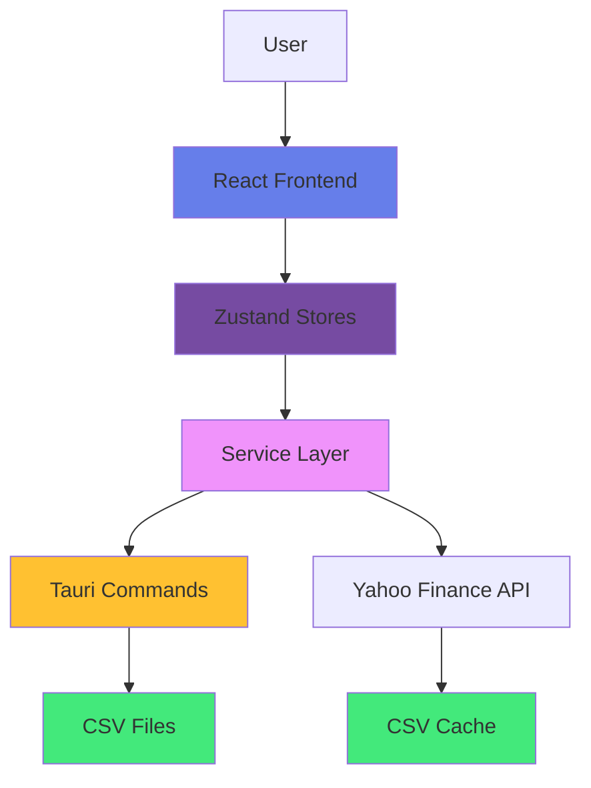
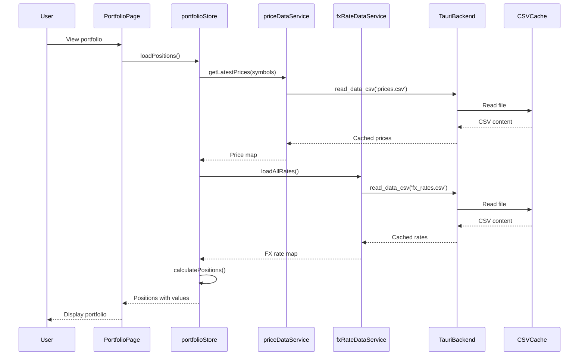
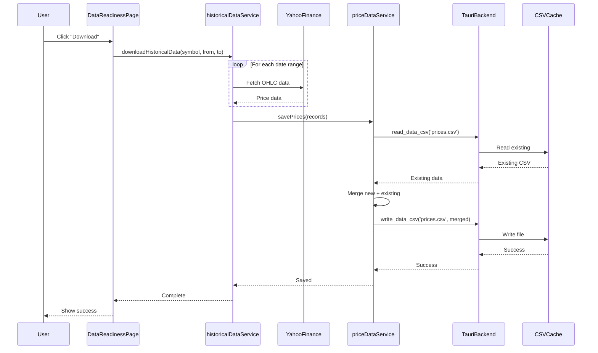
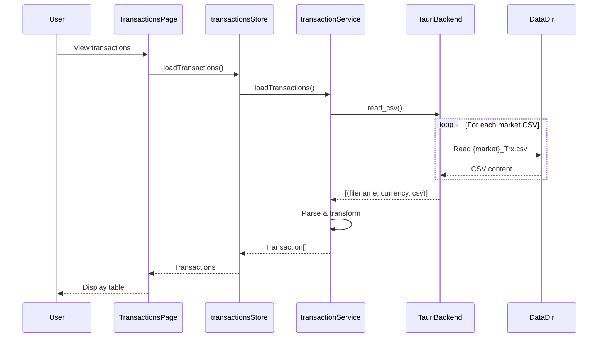
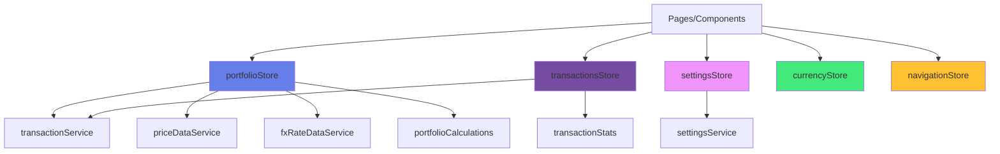
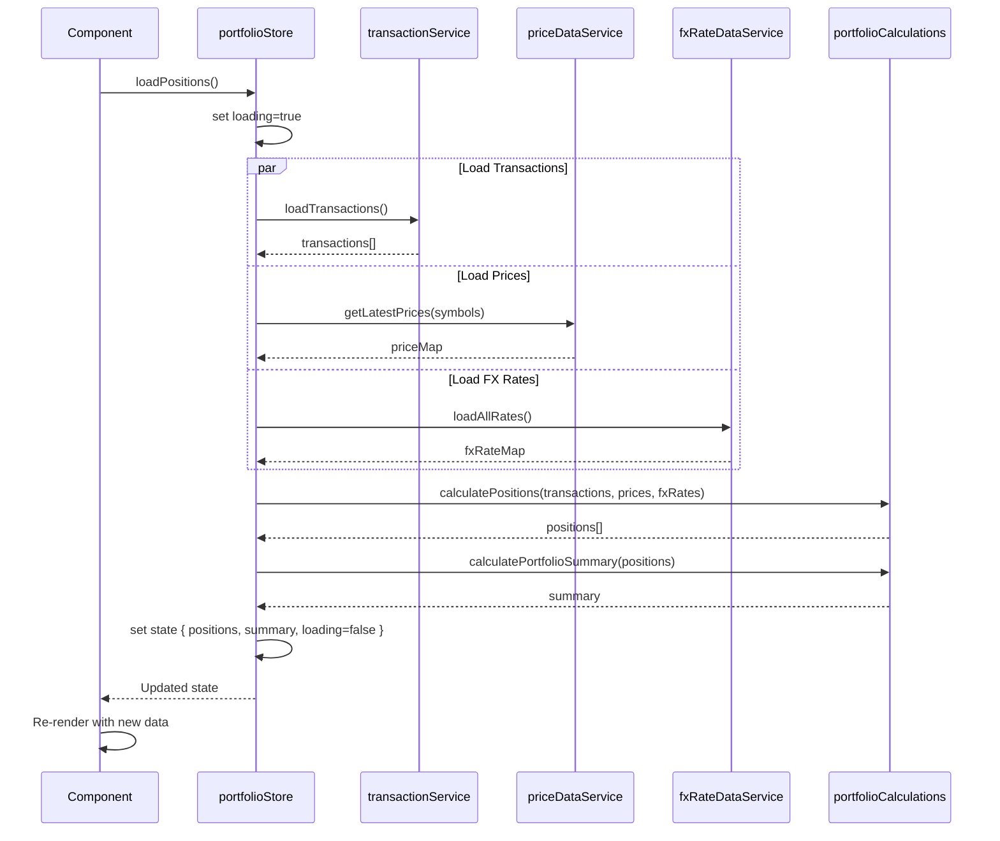
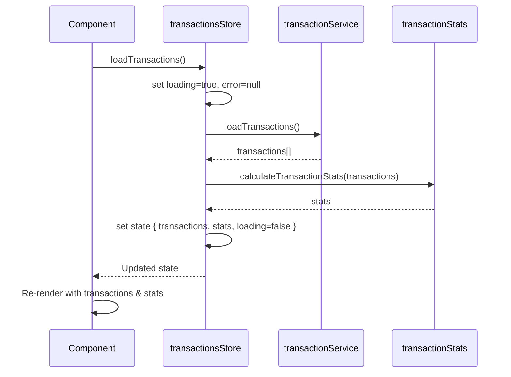
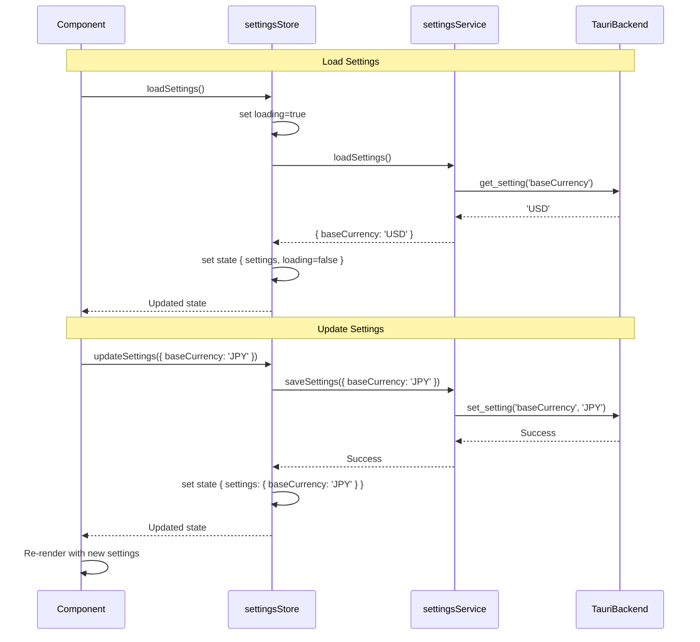

# Portfolio Manager

A cross-platform desktop application for tracking and managing multi-market investment portfolios (US, Taiwan, Japan, Hong Kong) with a privacy-first CSV storage model.


## Features

### 1. Portfolio Dashboard
- Real-time holdings view with current valuations
- Daily gain/loss tracking and filtering
- Currency conversion to base currency
- Interactive charts (currency allocation donut, top holdings bar)
- Advanced sorting and filtering

### 2. Portfolio Heatmap
- TradingView-style visualization with color-coded performance
- Cell size represents portfolio weight
- Dual view modes (heatmap and table)
- Daily performance tracking per position

### 3. Transaction Management
- Multi-market support (USD, TWD, JPY, HKD)
- Transaction statistics by type and currency
- Advanced filtering and search
- Sortable columns

### 4. Historical Data Download
- Yahoo Finance integration for stock prices and FX rates
- Batch processing for multiple symbols
- Date range selection
- Automatic CSV caching

### 5. Settings
- Base currency selection
- CSV-based storage
- Privacy-first design (all data local)

## Screenshots

### Dashboard View
Transaction statistics with breakdowns by type and currency

### Data Table
Sortable, filterable table with search functionality

### Portfolio Overview
Interactive charts plus refined tables with filters for holdings

## Installation

### Prerequisites

- Node.js 22+ ([Download](https://nodejs.org/))
- Rust 1.70+ ([Install](https://rustup.rs/))
- Tauri prerequisites for your platform ([Setup Guide](https://tauri.app/v1/guides/getting-started/prerequisites))

### Setup

1. **Clone the repository**
   ```bash
   git clone <repository-url>
   cd portfolio/desktop
   ```
2. **Install dependencies**
   ```bash
   npm install
   ```
3. **Run in development mode**
   ```bash
   npm run tauri:dev
   ```
4. **Build for production**
   ```bash
   npm run tauri:build
   ```
   The packaged application is generated under `src-tauri/target/release/`.

## Usage

### Adding Transaction Data

Place your broker CSV exports inside `desktop/data/` before launching the app:

- `US_Trx.csv` - US market transactions (USD)
- `TW_Trx.csv` - Taiwan market transactions (TWD)
- `JP_Trx.csv` - Japan market transactions (JPY)
- `HK_Trx.csv` - Hong Kong market transactions (HKD)

Each CSV should follow this schema:

```csv
Date,Stock,Type,Quantity,Transacted Price (per unit),Fees,Stock Split Ratio
2024-01-15,NASDAQ:AAPL,Buy,10,150.00,1.00,1
2024-02-20,NASDAQ:MSFT,Sell,5,380.00,1.00,1
2024-03-10,NASDAQ:GOOGL,Dividend,0,2.50,0,1
```

### Price and FX Cache

The application mirrors Twelve Data results into CSV files under the OS-specific Tauri app data directory (for example, `~/Library/Application Support/com.kfpun.portfolio/data` on macOS). The following files are created automatically:

- `prices.csv` – last close prices per symbol with OHLC data
- `fx_rates.csv` – cached FX rates (future use)
- `securities.csv` – security metadata (future use)
- `settings.csv` – serialized application preferences and API keys

Rust commands (`read_storage_csv`, `write_storage_csv`, `append_storage_csv`) expose these files to the frontend so React can read and persist CSV data without leaving the user directory.

### Using the Application

1. **Launch the app** – CSV transactions are merged, validated, and displayed instantly.
2. **Portfolio page** – Use the filter bar to search by ticker, filter by currency, toggle gainers/losers, and sort by any column. Select a base currency at the top and toggle "Show values in [currency]" to convert all holdings to your preferred currency. Charts visualize currency allocation and the largest holdings.
3. **Heatmap page** – View a TradingView-style heatmap of your holdings with color-coded performance. Cell size represents portfolio weight. Switch between Heatmap View and Table View to see detailed daily gain/loss data for each position.
4. **Transaction page** – Search, sort, and filter transactions by type and currency with comprehensive statistics.
5. **Settings page** – Configure Twelve Data and AlphaVantage API keys, and set your preferred base currency.
6. **Price refresh** – The Update Prices action fetches last-close data, retries automatically on rate limits, and saves each successful response back into `prices.csv` for offline reuse.

## Project Structure

```
portfolio/desktop/
├─ src/                       # React frontend
│  ├─ components/            # Reusable UI components
│  ├─ pages/                 # Portfolio, Heatmap, Transactions, Settings
│  ├─ services/              # API, CSV, and price services
│  ├─ store/                 # Zustand state management stores
│  ├─ types/                 # TypeScript interfaces
│  └─ utils/                 # Calculators, rate limiter
├─ src-tauri/                # Rust + Tauri backend
│  ├─ src/main.rs            # Commands + CSV helpers
│  └─ Cargo.toml
├─ data/                     # User-provided transaction CSV files
├─ tests/                    # Vitest unit tests
├─ .husky/                   # Git hooks configuration
├─ package.json
└─ README.md
```

## Development

### Tech Stack

- **Frontend**: React 18, TypeScript, Vite, styled-components, Zustand
- **Backend**: Rust + Tauri commands
- **State Management**: Zustand for global state
- **Testing**: Vitest with comprehensive unit tests
- **Charts**: Custom SVG-based visuals
- **Icons**: lucide-react
- **Git Hooks**: Husky for pre-commit linting and testing

### Available Scripts

```bash
npm run tauri:dev   # start dev server with hot reload
npm run lint        # type-check TypeScript (no emit)
npm test            # run Vitest unit tests
npm run build       # build frontend
npm run tauri:build # package the app for production
```

## Architecture

### High-Level Architecture



### Data Flow Diagrams

#### 1. Portfolio Calculation Flow



#### 2. Historical Data Download Flow



#### 3. Transaction Loading Flow



### Data Management

#### CSV File Structure

**Transaction Files** (User-managed in `desktop/data/`):
- `US_Trx.csv` - US market transactions (USD)
- `TW_Trx.csv` - Taiwan market transactions (TWD)
- `JP_Trx.csv` - Japan market transactions (JPY)
- `HK_Trx.csv` - Hong Kong market transactions (HKD)

**Cache Files** (Auto-managed in app data directory):
- `prices.csv` - Historical price data with OHLC
- `fx_rates.csv` - Currency exchange rates
- `settings.csv` - Application preferences

**App Data Directory Location**:
- macOS: `~/Library/Application Support/com.portfolio.manager/data/`
- Windows: `C:\Users\{username}\AppData\Roaming\com.portfolio.manager\data\`
- Linux: `~/.config/com.portfolio.manager/data/`

#### CSV Formats

**Transaction CSV** (`{market}_Trx.csv`):
```csv
date,stock,type,quantity,price,fees,split_ratio,currency
2024-01-15,NASDAQ:AAPL,Buy,100,150.25,9.99,1.0,USD
2024-02-20,NASDAQ:AAPL,Dividend,100,0.24,0,1.0,USD
```

**Price Cache CSV** (`prices.csv`):
```csv
symbol,date,close,open,high,low,volume,source,updated_at
NASDAQ:AAPL,2024-12-02,180.25,178.50,181.00,177.80,52340100,yahoo_finance,2024-12-03T10:30:00.000Z
TPE:2330,2024-12-02,625.00,620.00,628.00,618.00,25000000,manual,2024-12-03T10:30:15.000Z
```

**FX Rate Cache CSV** (`fx_rates.csv`):
```csv
from_currency,to_currency,date,rate,source,updated_at
USD,JPY,2024-12-02,150.25,yahoo_finance,2024-12-03T10:30:00.000Z
TWD,USD,2024-12-02,0.0312,yahoo_finance,2024-12-03T10:30:15.000Z
```

**Settings CSV** (`settings.csv`):
```csv
key,value
baseCurrency,USD
```

#### Tauri Backend Commands

| Command | Purpose | Input | Output |
|---------|---------|-------|--------|
| `read_csv()` | Load transaction files | None | `[(filename, currency, csv_content)]` |
| `read_data_csv(filename)` | Read cache file | Filename | CSV content string |
| `write_data_csv(filename, content)` | Write/overwrite cache | Filename, CSV content | Success/Error |
| `append_data_csv(filename, content)` | Append to cache | Filename, CSV rows | Success/Error |
| `get_setting(key)` | Get setting value | Setting key | Value string |
| `set_setting(key, value)` | Save setting | Key, Value | Success/Error |

#### Data Flow Patterns

**Reading Data**:
1. Service layer calls Tauri command
2. Tauri reads CSV from filesystem
3. Returns raw CSV string
4. Service parses CSV (using PapaParse or manual parsing)
5. Transforms to TypeScript types
6. Returns to store/component

**Writing Data**:
1. Component/store calls service method
2. Service transforms data to CSV format
3. Service calls Tauri command with CSV string
4. Tauri writes to filesystem
5. Returns success/error
6. Service propagates result

**Caching Strategy**:
- Read from cache first (instant)
- If missing or stale, fetch from Yahoo Finance
- Save to cache immediately after fetch
- Merge with existing cache (don't overwrite)
- Cache persists across app restarts

### Frontend State Management (Zustand Stores)

#### Store Architecture



#### Store Inventory

| Store | Purpose | Key State | Key Actions |
|-------|---------|-----------|-------------|
| `portfolioStore` | Portfolio calculations & positions | `positions`, `summary`, `prices`, `fxRates` | `loadPositions()`, `loadPrices()`, `loadFxRates()` |
| `transactionsStore` | Transaction data & stats | `transactions`, `stats`, `loading`, `error` | `loadTransactions()`, `refreshStats()` |
| `settingsStore` | App settings | `settings` (baseCurrency), `loading`, `error` | `loadSettings()`, `updateSettings()` |
| `currencyStore` | Currency filter state | `selectedCurrency` | `setSelectedCurrency()` |
| `navigationStore` | Page navigation | `currentPage` | `setCurrentPage()` |

#### Portfolio Store Data Flow



#### Transactions Store Data Flow



#### Settings Store Data Flow



#### Store Communication Pattern

**Direct Store Access** (Components read from multiple stores):
```typescript
// PortfolioPage.tsx
function PortfolioPage() {
  // Multiple stores in one component
  const { positions, loading } = usePortfolioStore();
  const { settings } = useSettingsStore();
  const { selectedCurrency } = useCurrencyStore();

  // Computed values based on multiple stores
  const filteredPositions = useMemo(() => {
    let result = positions;
    if (selectedCurrency !== 'All') {
      result = result.filter(p => p.currency === selectedCurrency);
    }
    return result;
  }, [positions, selectedCurrency]);
}
```

**Store Independence** (No inter-store dependencies):
- Each store is self-contained
- Components orchestrate data from multiple stores
- No store directly calls another store
- Shared services provide data to multiple stores

**State Update Flow**:
1. User action triggers component handler
2. Component calls store action
3. Store sets loading state
4. Store calls service layer
5. Service calls Tauri backend or external API
6. Service returns transformed data
7. Store updates state
8. Components re-render via Zustand subscription

## Development Resources

- [CLAUDE.md](CLAUDE.md) - Main development guide with architecture and patterns
- [desktop/src/CLAUDE.md](desktop/src/CLAUDE.md) - Frontend-specific guidelines (React, Zustand, styled-components)
- [desktop/src-tauri/CLAUDE.md](desktop/src-tauri/CLAUDE.md) - Backend-specific guidelines (Rust, Tauri commands)
- [requirements.md](requirements.md) - Detailed project requirements

## Testing

78 unit tests with Vitest covering:
- CSV utilities
- Portfolio calculations
- Transaction statistics
- Service layer
- Zustand stores

Run tests:
```bash
npm test
```
