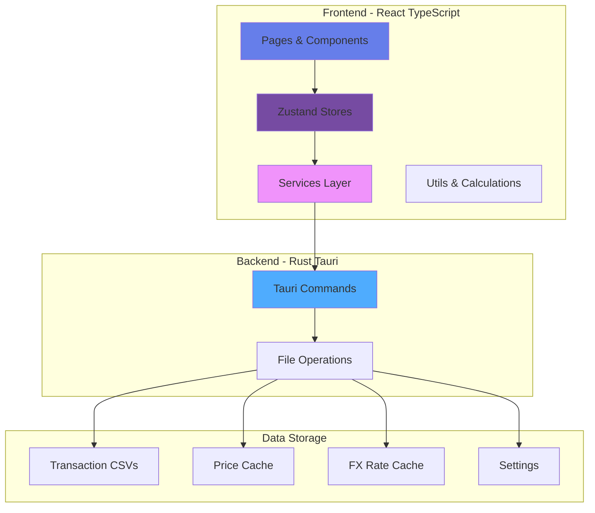
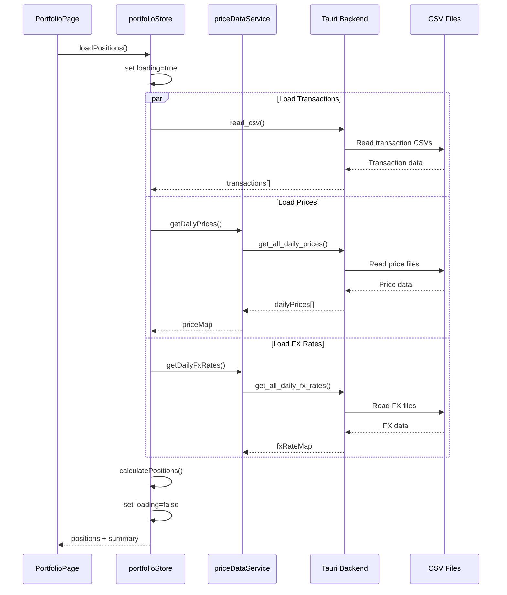
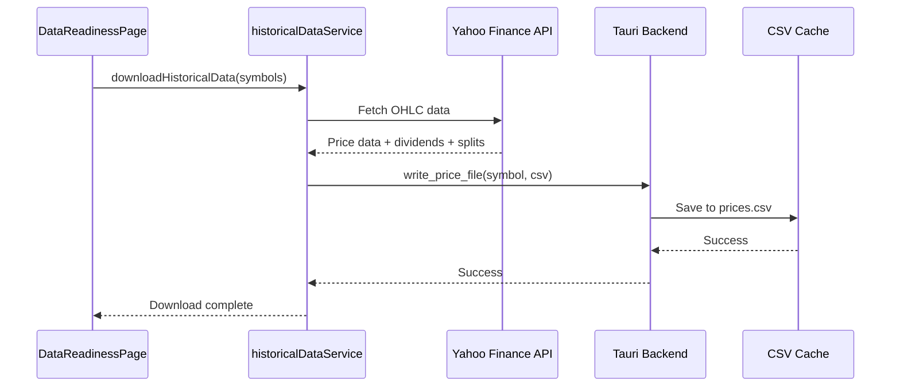

# Portfolio Manager

A cross-platform desktop application for tracking and managing multi-market investment portfolios (US, Taiwan, Japan, Hong Kong) with a privacy-first CSV storage model.


## ✨ Features

### 📊 Dashboard
- **Real-time Portfolio Valuation**: Live holdings view with current market values
- **Daily Performance Tracking**: Compare today vs yesterday's performance
- **Multi-Currency Support**: Automatic FX conversion to base currency
- **Interactive Visualizations**:
  - Currency allocation donut chart
  - Top 5 positions bar chart
  - Performance indicators with color coding
- **Advanced Filtering**: Search by ticker, filter by currency, show gainers/losers
- **Responsive Design**: Optimized for desktop viewing

### 📈 Reports & Analytics
- **Positions Report**: Detailed positions table with comprehensive filtering and sorting
- **Heatmaps**: TradingView-style visual charts for portfolio allocation
- **Performance Metrics**: Gain/loss calculations, portfolio weights, currency breakdowns

### 💼 Transaction Management
- **Multi-Market Support**: Unified view across USD, TWD, JPY, HKD markets
- **Transaction Analytics**: Statistics by type (Buy/Sell/Dividend/Split) and currency
- **Advanced Search**: Filter by stock, type, date, or currency
- **Data Validation**: Automatic parsing and validation of transaction data

### 📥 Historical Data Management
- **Yahoo Finance Integration**: Automated price and FX rate downloads
- **Batch Processing**: Efficient bulk downloads with rate limiting
- **Data Caching**: Local CSV storage for offline access
- **Progress Tracking**: Real-time download progress and status updates

### ⚙️ Settings & Configuration
- **Base Currency Selection**: Choose display currency (USD/TWD/JPY/HKD)
- **Data Readiness Monitoring**: Track historical data coverage and gaps
- **Currency Data Management**: FX rate visualization and overrides
- **Privacy-First**: All data stored locally in CSV files

## 🚀 Quick Start

### Prerequisites

- **Node.js 22+** ([Download](https://nodejs.org/))
- **Rust 1.70+** ([Install](https://rustup.rs/))
- **Tauri CLI** ([Setup Guide](https://tauri.app/v1/guides/getting-started/prerequisites))

### Installation

1. **Clone the repository**
   ```bash
   git clone <repository-url>
   cd portfolio/desktop
   ```

2. **Install dependencies**
   ```bash
   npm install
   ```

3. **Start development server**
   ```bash
   npm run tauri:dev
   ```

4. **Build for production**
   ```bash
   npm run tauri:build
   ```

## 📁 Data Setup

### Transaction Files

Place your broker CSV exports in the `desktop/data/` directory:

- `US_Trx.csv` - US market transactions (USD)
- `TW_Trx.csv` - Taiwan market transactions (TWD)
- `JP_Trx.csv` - Japan market transactions (JPY)
- `HK_Trx.csv` - Hong Kong market transactions (HKD)

**CSV Format**:
```csv
date,stock,type,quantity,price,fees,split_ratio,currency
2024-01-15,NASDAQ:AAPL,Buy,10,150.00,1.00,1,USD
2024-02-20,NASDAQ:MSFT,Sell,5,380.00,1.00,1,USD
2024-03-10,NASDAQ:AAPL,Dividend,0,2.50,0,1,USD
```

### Data Storage

The application uses a privacy-first CSV storage architecture:

**App Data Directory**:
- **macOS**: `~/Library/Application Support/com.portfolio.manager/data/`
- **Windows**: `C:\Users\{username}\AppData\Roaming\com.portfolio.manager\data\`
- **Linux**: `~/.config/com.portfolio.manager/data/`

**Cache Files** (auto-managed):
- `prices.csv` - Historical price data with OHLC
- `fx_rates.csv` - Currency exchange rates
- `settings.csv` - Application preferences
- `dividends/` - Per-symbol dividend data
- `splits/` - Stock split records
- `yahoo_metas/` - Yahoo Finance metadata

## 🏗️ Architecture

### Tech Stack

- **Frontend**: React 18 + TypeScript + Vite + Zustand
- **Backend**: Rust + Tauri v1.5
- **UI**: styled-components (no Tailwind CSS)
- **Charts**: Recharts + lightweight-charts v5
- **Tables**: TanStack Table
- **State**: Zustand stores with clean separation
- **Data**: Pure CSV files (no database)
- **Testing**: Vitest with comprehensive coverage

### Clean Architecture



### State Management

| Store | Purpose | Key State |
|-------|---------|-----------|
| `portfolioStore` | Portfolio calculations & positions | `positions[]`, `summary`, `fxRates` |
| `transactionsStore` | Transaction data & statistics | `transactions[]`, `stats` |
| `settingsStore` | User preferences | `baseCurrency`, `settings` |
| `currencyStore` | UI currency filter | `selectedCurrency` |
| `navigationStore` | Page navigation | `currentPage` |

## 🔧 Development

### Available Scripts

```bash
npm run tauri:dev      # Start development server with hot reload
npm run lint           # Type-check TypeScript (no emit)
npm run test           # Run Vitest unit tests
npm run build          # Build frontend
npm run tauri:build    # Package app for production
```

### Project Structure

```
portfolio/desktop/
├── src/                          # React frontend
│   ├── components/               # Reusable UI components
│   │   ├── ui/                   # Base UI components
│   │   └── PageLayout.tsx        # Layout components
│   ├── pages/                    # Page-level components
│   │   ├── DashboardPage.tsx     # Main portfolio view
│   │   ├── TransactionsPage.tsx  # Transaction management
│   │   ├── DataReadinessPage.tsx # Data download management
│   │   └── SettingsPage.tsx      # Settings & configuration
│   ├── services/                 # Backend communication
│   │   ├── priceDataService.ts   # Price data management
│   │   ├── transactionService.ts # Transaction handling
│   │   └── fxRateDataService.ts  # FX rate management
│   ├── store/                    # Zustand state management
│   │   ├── portfolioStore.ts     # Portfolio state
│   │   ├── transactionsStore.ts  # Transaction state
│   │   └── settingsStore.ts      # Settings state
│   ├── types/                    # TypeScript definitions
│   ├── utils/                    # Pure utility functions
│   └── config/                   # Configuration files
├── src-tauri/                    # Rust backend
│   ├── src/main.rs               # Tauri commands & logic
│   ├── Cargo.toml                # Rust dependencies
│   └── tauri.conf.json           # Tauri configuration
├── data/                         # User transaction CSVs
├── tests/                        # Unit tests
└── package.json                  # Node dependencies
```

### Key Design Patterns

- **Clean Architecture**: Clear separation between UI, business logic, and data
- **CSV-First Storage**: Privacy-focused, Excel-compatible data storage
- **Batch API Optimization**: Single Rust calls for multiple data fetches
- **Rate Limiting**: Built-in delays to respect API limits
- **Offline-First**: Cached data for fast loading and offline access

## 📊 Data Flow Examples

### Portfolio Loading


### Historical Data Download


## 🧪 Testing

Comprehensive test suite with 78+ unit tests covering:
- CSV parsing and validation
- Portfolio calculations
- Transaction statistics
- Service layer functionality
- Zustand store logic

```bash
npm test                    # Run all tests
npm test -- --watch         # Watch mode
npm test -- --coverage      # Coverage report
```

## 📚 Documentation

- **[CLAUDE.md](CLAUDE.md)** - Main development guide with architecture and patterns
- **[desktop/src/CLAUDE.md](desktop/src/CLAUDE.md)** - Frontend-specific guidelines
- **[desktop/src-tauri/CLAUDE.md](desktop/src-tauri/CLAUDE.md)** - Backend-specific guidelines
- **[requirements.md](requirements.md)** - Detailed project requirements
- **[BATCH_API_IMPLEMENTATION.md](BATCH_API_IMPLEMENTATION.md)** - Batch API optimization details
- **[PAGE_RUST_CALLS.md](PAGE_RUST_CALLS.md)** - Rust call patterns analysis

## 🤝 Contributing

1. Fork the repository
2. Create a feature branch (`git checkout -b feature/amazing-feature`)
3. Commit your changes (`git commit -m 'Add amazing feature'`)
4. Push to the branch (`git push origin feature/amazing-feature`)
5. Open a Pull Request

## 📄 License

This project is licensed under the MIT License - see the [LICENSE](LICENSE) file for details.

## 🙏 Acknowledgments

- **Yahoo Finance** for providing free market data
- **Tauri** for the excellent desktop application framework
- **React** ecosystem for robust frontend development tools
- **Rust** community for high-performance systems programming
