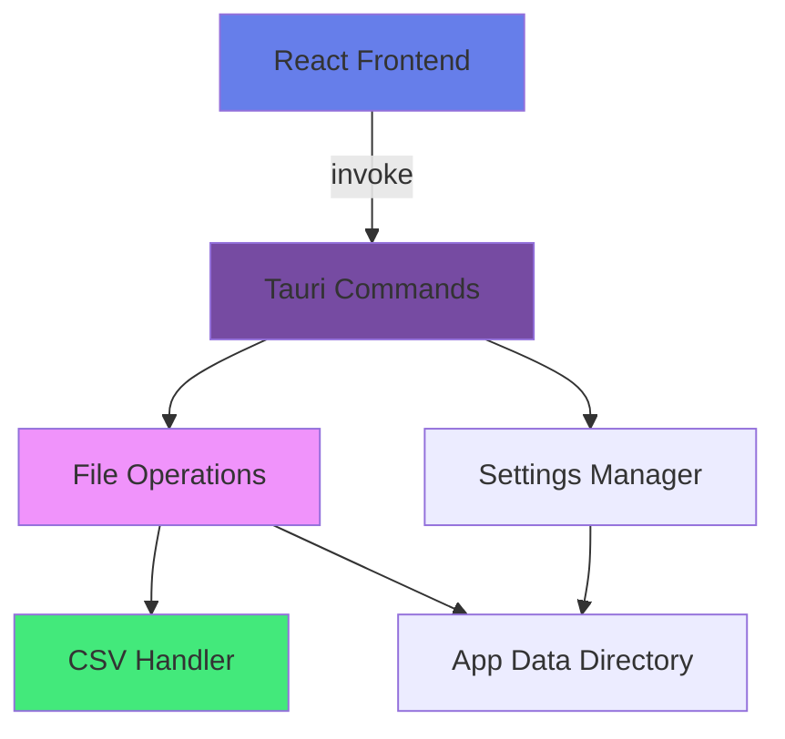

# Tauri Backend Development Guide

## Overview

This directory contains the Rust backend for the Portfolio Manager application. Built with Tauri v1.5, it provides secure file system operations and command handling for the React frontend.

## Architecture



## Project Structure

```
src-tauri/
├── src/
│   └── main.rs           # Main entry point & Tauri commands
├── Cargo.toml            # Rust dependencies
├── tauri.conf.json       # Tauri configuration
├── build.rs              # Build script
└── icons/                # App icons
```

## Tauri Commands

All commands are exposed via `#[tauri::command]` macro and registered in the `invoke_handler`.

### Transaction Commands

#### `read_csv`

**Purpose**: Load transaction CSV files from the data directory

**Signature**:
```rust
#[tauri::command]
fn read_csv() -> Result<Vec<(String, String, String)>, String>
```

**Returns**:
```rust
Vec<(
    String,  // Market identifier (e.g., "US_Trx.csv")
    String,  // Currency code (e.g., "USD")
    String   // CSV content
)>
```

**Implementation Details**:
- Reads from predefined list of market CSV files:
  - `US_Trx.csv` → USD
  - `TW_Trx.csv` → TWD
  - `JP_Trx.csv` → JPY
  - `HK_Trx.csv` → HKD
- Uses `data_dir()` from tauri::api::path to get app data directory
- Returns empty string for missing files (no error)
- Reads file content as UTF-8 string

**Error Handling**:
- Returns `Err(String)` if data directory cannot be accessed
- Returns empty CSV content if file doesn't exist (allows frontend to handle)
- Logs errors to console with `eprintln!`

**Frontend Usage**:
```typescript
const transactions = await invoke<[string, string, string][]>('read_csv');
// transactions = [["US_Trx.csv", "USD", "date,stock,type,..."]]
```

### Settings Commands

#### `get_setting`

**Purpose**: Retrieve a single setting value by key

**Signature**:
```rust
#[tauri::command]
fn get_setting(key: &str) -> Result<String, String>
```

**Parameters**:
- `key`: Setting key to retrieve (e.g., "baseCurrency")

**Returns**:
- Setting value as JSON string
- Empty string if key doesn't exist

**Implementation Details**:
- Reads from `settings.csv` in app data directory
- Parses CSV manually (simple key-value format)
- Returns value for matching key
- Case-sensitive key matching

**Error Handling**:
- Returns empty string if settings.csv doesn't exist
- Returns empty string if key not found
- Returns `Err(String)` only on file read errors

**Frontend Usage**:
```typescript
const baseCurrency = await invoke<string>('get_setting', { key: 'baseCurrency' });
```

#### `set_setting`

**Purpose**: Save a single setting value

**Signature**:
```rust
#[tauri::command]
fn set_setting(key: &str, value: &str) -> Result<(), String>
```

**Parameters**:
- `key`: Setting key (e.g., "baseCurrency")
- `value`: Setting value as string

**Implementation Details**:
- Creates `settings.csv` if it doesn't exist
- Updates existing key or appends new key-value pair
- Preserves other settings
- Writes in CSV format: `key,value`

**Error Handling**:
- Returns `Err(String)` if directory creation fails
- Returns `Err(String)` if file write fails
- Logs errors to console

**Frontend Usage**:
```typescript
await invoke('set_setting', { key: 'baseCurrency', value: 'USD' });
```

### Data File Commands

#### `read_data_csv`

**Purpose**: Read CSV data files from the data directory (prices.csv, fx_rates.csv)

**Signature**:
```rust
#[tauri::command]
fn read_data_csv(filename: String) -> Result<String, String>
```

**Parameters**:
- `filename`: Name of CSV file to read (e.g., "prices.csv")

**Returns**:
- CSV file content as string
- Empty string if file doesn't exist

**Implementation Details**:
- Reads from app data directory
- Used for prices.csv and fx_rates.csv
- Returns raw CSV content for frontend parsing

**Error Handling**:
- Returns empty string if file doesn't exist (not an error)
- Returns `Err(String)` on file read errors

**Frontend Usage**:
```typescript
const pricesCSV = await invoke<string>('read_data_csv', { filename: 'prices.csv' });
```

#### `write_data_csv`

**Purpose**: Write/overwrite CSV data files

**Signature**:
```rust
#[tauri::command]
fn write_data_csv(filename: String, content: String) -> Result<(), String>
```

**Parameters**:
- `filename`: Name of CSV file (e.g., "prices.csv")
- `content`: Complete CSV content to write

**Implementation Details**:
- Overwrites existing file completely
- Creates file if it doesn't exist
- Creates data directory if needed
- Used for bulk price/FX rate updates

**Error Handling**:
- Returns `Err(String)` if directory creation fails
- Returns `Err(String)` if file write fails

**Frontend Usage**:
```typescript
await invoke('write_data_csv', {
  filename: 'prices.csv',
  content: csvContent
});
```

#### `append_data_csv`

**Purpose**: Append rows to existing CSV file

**Signature**:
```rust
#[tauri::command]
fn append_data_csv(filename: String, content: String) -> Result<(), String>
```

**Parameters**:
- `filename`: Name of CSV file
- `content`: CSV rows to append (without header)

**Implementation Details**:
- Appends to existing file
- Does NOT add header row
- Creates file if it doesn't exist
- Used for incremental updates

**Error Handling**:
- Returns `Err(String)` if directory creation fails
- Returns `Err(String)` if file write fails

**Frontend Usage**:
```typescript
await invoke('append_data_csv', {
  filename: 'prices.csv',
  content: 'NASDAQ:AAPL,2024-12-03,180.25,...\n'
});
```

## File System Operations

### App Data Directory

**Location by Platform**:
- macOS: `~/Library/Application Support/com.portfolio.manager/`
- Windows: `C:\Users\{username}\AppData\Roaming\com.portfolio.manager\`
- Linux: `~/.config/com.portfolio.manager/`

**Directory Structure**:
```
{app_data_dir}/
├── data/
│   ├── US_Trx.csv        # US market transactions
│   ├── TW_Trx.csv        # Taiwan market transactions
│   ├── JP_Trx.csv        # Japan market transactions
│   ├── HK_Trx.csv        # Hong Kong market transactions
│   ├── prices.csv        # Cached price data
│   ├── fx_rates.csv      # Cached FX rates
│   └── settings.csv      # App settings (CSV format)
└── logs/                 # Application logs (if enabled)
```

### Path Resolution

```rust
use tauri::api::path::data_dir;

fn get_data_path(app_handle: &tauri::AppHandle) -> Result<PathBuf, String> {
    let mut path = data_dir()
        .ok_or("Failed to get data directory")?;

    path.push("com.portfolio.manager");
    path.push("data");

    if !path.exists() {
        std::fs::create_dir_all(&path)
            .map_err(|e| format!("Failed to create data directory: {}", e))?;
    }

    Ok(path)
}
```

### File Operations Pattern

**Reading Files**:
```rust
let mut path = get_data_path()?;
path.push("filename.csv");

if !path.exists() {
    return Ok(String::new()); // Return empty string, not error
}

std::fs::read_to_string(path)
    .map_err(|e| format!("Failed to read file: {}", e))
```

**Writing Files**:
```rust
let mut path = get_data_path()?;
path.push("filename.csv");

std::fs::write(&path, content)
    .map_err(|e| format!("Failed to write file: {}", e))
```

**Appending to Files**:
```rust
use std::fs::OpenOptions;
use std::io::Write;

let mut path = get_data_path()?;
path.push("filename.csv");

let mut file = OpenOptions::new()
    .create(true)
    .append(true)
    .open(&path)
    .map_err(|e| format!("Failed to open file: {}", e))?;

writeln!(file, "{}", content)
    .map_err(|e| format!("Failed to write to file: {}", e))
```

## CSV Handling

### Settings CSV Format

**File**: `settings.csv`

**Format**:
```csv
key,value
baseCurrency,USD
```

**Parsing**:
```rust
fn parse_settings(content: &str) -> HashMap<String, String> {
    let mut settings = HashMap::new();

    for line in content.lines().skip(1) { // Skip header
        let parts: Vec<&str> = line.split(',').collect();
        if parts.len() >= 2 {
            settings.insert(parts[0].to_string(), parts[1].to_string());
        }
    }

    settings
}
```

### Transaction CSV Format

**Files**: `US_Trx.csv`, `TW_Trx.csv`, `JP_Trx.csv`, `HK_Trx.csv`

**Format**:
```csv
date,stock,type,quantity,price,fees,split_ratio,currency
2024-01-15,AAPL,Buy,100,150.25,9.99,1.0,USD
2024-02-20,AAPL,Dividend,100,0.24,0,1.0,USD
```

**Fields**:
- `date`: Transaction date (YYYY-MM-DD)
- `stock`: Stock symbol
- `type`: Buy | Sell | Dividend | Split
- `quantity`: Number of shares
- `price`: Price per share
- `fees`: Transaction fees
- `split_ratio`: Stock split ratio (default 1.0)
- `currency`: Transaction currency (USD, TWD, JPY, HKD)

**Parsing**: Done in frontend with PapaParse library

## Error Handling

### Error Propagation Pattern

```rust
#[tauri::command]
fn your_command() -> Result<YourType, String> {
    // Use ? operator to propagate errors
    let data = some_operation()
        .map_err(|e| format!("Operation failed: {}", e))?;

    Ok(data)
}
```

### Error Message Guidelines

- **User-facing**: Clear, actionable messages
- **Developer-facing**: Include context and error details
- **Logging**: Use `eprintln!` for stderr output

**Examples**:
```rust
// Good
Err(format!("Failed to read transactions from {}: {}", filename, e))

// Bad
Err("Error".to_string())
```

### Silent Failures

Some operations return empty/default values instead of errors:
- Missing transaction files → empty string (allows new portfolios)
- Missing settings → empty string (uses defaults)
- Missing price cache → empty string (triggers fresh fetch)

## Security Considerations

### File System Access

- ✅ **Sandboxed**: All file operations restricted to app data directory
- ✅ **No arbitrary paths**: Commands don't accept full file paths
- ✅ **Validated filenames**: Only predefined files accessible
- ❌ **Path traversal prevention**: Should add validation for `..` in filenames

**Improvement Needed**:
```rust
fn validate_filename(filename: &str) -> Result<(), String> {
    if filename.contains("..") || filename.contains("/") || filename.contains("\\") {
        return Err("Invalid filename".to_string());
    }
    Ok(())
}
```

### Data Privacy

- API keys stored in local CSV (not encrypted)
- Transaction data never leaves device
- No network requests from Rust backend
- All external API calls handled by frontend

**Future Enhancement**: Encrypt settings.csv using OS keychain

## Build Configuration

### Cargo.toml

**Key Dependencies**:
```toml
[dependencies]
tauri = { version = "1.5", features = ["api-all"] }
serde = { version = "1.0", features = ["derive"] }
serde_json = "1.0"
```

**Build Profile**:
```toml
[profile.release]
panic = "abort"
codegen-units = 1
lto = true
opt-level = "z"
strip = true
```

### tauri.conf.json

**Key Configuration**:
```json
{
  "package": {
    "productName": "Portfolio Manager",
    "version": "0.1.0"
  },
  "tauri": {
    "allowlist": {
      "all": false,
      "path": {
        "all": true
      },
      "fs": {
        "all": true,
        "scope": ["$APPDATA/*"]
      }
    }
  }
}
```

**Security Settings**:
- `all: false` - Deny all by default
- `fs.scope: ["$APPDATA/*"]` - Restrict to app data directory
- CSP headers configured in bundleResources

## Development Commands

```bash
# Run in development mode
cargo tauri dev

# Build for production
cargo tauri build

# Run Rust tests
cargo test

# Check for errors without building
cargo check

# Format code
cargo fmt

# Lint code
cargo clippy
```

## Logging

### Development Logging

```rust
// Console output (development)
println!("Info: {}", message);
eprintln!("Error: {}", error);

// Debug output (removed in release)
#[cfg(debug_assertions)]
eprintln!("Debug: {:?}", data);
```

### Production Logging

Consider adding structured logging:

```toml
[dependencies]
log = "0.4"
env_logger = "0.10"
```

```rust
use log::{info, error, debug};

fn main() {
    env_logger::init();

    tauri::Builder::default()
        .setup(|_app| {
            info!("Application started");
            Ok(())
        })
        .run(tauri::generate_context!())
        .expect("error while running tauri application");
}
```

## Testing

### Unit Testing Pattern

```rust
#[cfg(test)]
mod tests {
    use super::*;

    #[test]
    fn test_parse_settings() {
        let csv = "key,value\nbaseCurrency,USD\n";
        let settings = parse_settings(csv);

        assert_eq!(settings.get("baseCurrency"), Some(&"USD".to_string()));
    }

    #[test]
    fn test_validate_filename() {
        assert!(validate_filename("prices.csv").is_ok());
        assert!(validate_filename("../etc/passwd").is_err());
        assert!(validate_filename("../../file").is_err());
    }
}
```

### Integration Testing

```rust
#[cfg(test)]
mod integration_tests {
    use tauri::test::mock_builder;

    #[test]
    fn test_read_csv_command() {
        let app = mock_builder().build();
        let result = read_csv();
        assert!(result.is_ok());
    }
}
```

## Common Patterns

### Safe Path Construction

```rust
fn get_file_path(filename: &str) -> Result<PathBuf, String> {
    // Validate filename
    validate_filename(filename)?;

    // Get base path
    let mut path = get_data_path()?;

    // Append filename
    path.push(filename);

    Ok(path)
}
```

### Safe File Reading

```rust
fn read_file_safe(filename: &str) -> Result<String, String> {
    let path = get_file_path(filename)?;

    if !path.exists() {
        return Ok(String::new());
    }

    std::fs::read_to_string(path)
        .map_err(|e| format!("Failed to read {}: {}", filename, e))
}
```

### Safe File Writing

```rust
fn write_file_safe(filename: &str, content: &str) -> Result<(), String> {
    let path = get_file_path(filename)?;

    // Create parent directory if needed
    if let Some(parent) = path.parent() {
        std::fs::create_dir_all(parent)
            .map_err(|e| format!("Failed to create directory: {}", e))?;
    }

    std::fs::write(path, content)
        .map_err(|e| format!("Failed to write {}: {}", filename, e))
}
```

## Troubleshooting

### Build Errors

**Error**: `Failed to resolve dependencies`
- Solution: Run `cargo update`
- Check Cargo.toml for version conflicts

**Error**: `Tauri CLI not found`
- Solution: Install with `npm install -g @tauri-apps/cli`

**Error**: `Rust compiler not found`
- Solution: Install Rust from rustup.rs

### Runtime Errors

**Error**: `Failed to get data directory`
- Check app permissions
- Verify tauri.conf.json allowlist configuration

**Error**: `Failed to read file: Permission denied`
- Check file permissions
- Verify app has write access to data directory

**Error**: `Command not found`
- Verify command is registered in invoke_handler
- Check command name matches frontend invoke call

## Best Practices

1. **Always validate input** - Never trust filenames from frontend
2. **Use Result types** - Propagate errors properly with `?`
3. **Log appropriately** - Use stderr for errors, stdout for info
4. **Handle missing files gracefully** - Return empty values when appropriate
5. **Document public functions** - Use `///` doc comments
6. **Write tests** - Cover edge cases and error paths
7. **Keep commands simple** - Complex logic belongs in separate modules
8. **Use structured errors** - Create error enums for better error handling

## Future Enhancements

- Add file locking for concurrent access
- Implement encrypted settings storage
- Add file backup/restore functionality
- Add command-line interface for debugging
- Implement proper logging framework
- Add metrics/telemetry collection
- Support for database storage (SQLite)
- Add data migration utilities
