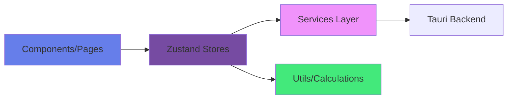

# Frontend Development Guide

## Overview

This directory contains the React TypeScript frontend for the Portfolio Manager application. The architecture follows Clean Architecture principles with clear separation of concerns.

## Architecture Layers



## Directory Structure

```
src/
├── components/        # Reusable UI components
├── pages/            # Page-level components
├── store/            # Zustand state management
├── services/         # Backend communication & external APIs
├── types/            # TypeScript type definitions
├── utils/            # Pure utility functions
├── App.tsx           # Main app component
└── main.tsx          # React entry point
```

## State Management with Zustand

### Store Pattern

All stores follow this pattern:

```typescript
import { create } from 'zustand';

interface YourState {
  // Data
  data: YourType | null;

  // Loading states
  loading: boolean;
  error: string | null;

  // Actions
  loadData: () => Promise<void>;
  updateData: (data: YourType) => Promise<void>;
}

export const useYourStore = create<YourState>((set, get) => ({
  data: null,
  loading: false,
  error: null,

  loadData: async () => {
    set({ loading: true, error: null });
    try {
      const data = await yourService.loadData();
      set({ data, loading: false });
    } catch (err) {
      set({
        error: err instanceof Error ? err.message : 'Failed to load',
        loading: false
      });
    }
  },

  updateData: async (newData) => {
    try {
      await yourService.saveData(newData);
      set({ data: newData });
    } catch (err) {
      const error = err instanceof Error ? err.message : 'Failed to save';
      set({ error });
      throw err; // Re-throw to let UI handle it
    }
  },
}));
```

### Current Stores

| Store | Purpose | Key State |
|-------|---------|-----------|
| `portfolioStore` | Portfolio calculations & prices | `positions`, `summary`, `fxRates` |
| `transactionsStore` | Transaction data | `transactions`, `stats` |
| `settingsStore` | App settings | `settings` (baseCurrency) |
| `currencyStore` | Currency filter | `selectedCurrency` |
| `navigationStore` | Page navigation | `currentPage` |

## Component Guidelines

### Component Structure

```typescript
// 1. Imports (grouped)
import { useState, useEffect } from 'react';  // React
import styled from 'styled-components';        // Styling
import { Icon1, Icon2 } from 'lucide-react';  // Icons
import { useYourStore } from '../store/yourStore';  // Stores
import { YourType } from '../types/YourType';       // Types
import { YourComponent } from '../components/YourComponent';  // Components

// 2. Styled Components
const Container = styled.div`
  padding: 2rem;
`;

const Title = styled.h1`
  font-size: 2rem;
  font-weight: 700;
`;

// 3. Component
export function YourPage() {
  // 3a. Stores
  const { data, loading, loadData } = useYourStore();

  // 3b. Local state
  const [filter, setFilter] = useState('');

  // 3c. Effects
  useEffect(() => {
    loadData();
  }, [loadData]);

  // 3d. Handlers
  const handleSearch = (query: string) => {
    setFilter(query);
  };

  // 3e. Computed values
  const filteredData = data?.filter(item =>
    item.name.includes(filter)
  );

  // 3f. Render
  if (loading) return <Container>Loading...</Container>;

  return (
    <Container>
      <Title>Your Page</Title>
      {/* ... */}
    </Container>
  );
}
```

### Naming Conventions

- **Components**: PascalCase (`PortfolioPage`, `DataTable`)
- **Stores**: camelCase with `Store` suffix (`portfolioStore`)
- **Handlers**: camelCase with `handle` prefix (`handleClick`)
- **Styled components**: PascalCase (`Container`, `Title`)
- **Props interfaces**: PascalCase with `Props` suffix (`PortfolioPageProps`)

## Service Layer

### Service Pattern

```typescript
import { invoke } from '@tauri-apps/api/tauri';
import { YourType } from '../types/YourType';

export class YourService {
  async loadData(): Promise<YourType[]> {
    try {
      const data = await invoke<string>('your_command');
      return JSON.parse(data);
    } catch (error) {
      console.error('Failed to load data:', error);
      throw error;
    }
  }

  async saveData(data: YourType): Promise<void> {
    try {
      await invoke('save_command', {
        data: JSON.stringify(data)
      });
    } catch (error) {
      console.error('Failed to save data:', error);
      throw error;
    }
  }
}

export const yourService = new YourService();
```

### Current Services

| Service | Purpose | Key Methods |
|---------|---------|-------------|
| `transactionService` | Load transactions | `loadTransactions()` |
| `settingsService` | Settings CRUD | `loadSettings()`, `saveSettings()` |
| `priceService` | Price cache reader | `getLastClosePrice()`, `getCachedPrices()` |
| `priceDataService` | Price CSV ops | `loadAllPrices()`, `savePrices()` |
| `fxRateDataService` | FX rate CSV ops | `loadAllRates()`, `saveRates()` |
| `historicalDataService` | Yahoo Finance downloader | `downloadHistoricalData()` |
| `historicalFxService` | FX rate downloader | `downloadHistoricalFxRates()` |

## Styling with styled-components

### Best Practices

```typescript
// ✅ Good - Use styled-components
const Card = styled.div`
  padding: 2rem;
  border-radius: 12px;
  background: white;
  box-shadow: 0 1px 3px rgba(0, 0, 0, 0.1);
`;

// ❌ Bad - DO NOT use Tailwind classes
<div className="p-8 rounded-xl bg-white shadow-sm">

// ✅ Good - Conditional styling with props
const Button = styled.button<{ $variant: 'primary' | 'secondary' }>`
  padding: 0.75rem 1.5rem;
  border-radius: 8px;
  background: ${props =>
    props.$variant === 'primary'
      ? 'linear-gradient(135deg, #667eea 0%, #764ba2 100%)'
      : '#f1f5f9'
  };
  color: ${props => props.$variant === 'primary' ? 'white' : '#0f172a'};
`;

// Usage
<Button $variant="primary">Save</Button>
```

### Color System

```typescript
// Currency colors
const CURRENCY_COLORS = {
  USD: '#2563eb',  // Blue
  TWD: '#dc2626',  // Red
  JPY: '#16a34a',  // Green
  HKD: '#fb923c',  // Orange
};

// Transaction type colors
const TYPE_COLORS = {
  Buy: '#16a34a',      // Green
  Sell: '#dc2626',     // Red
  Dividend: '#2563eb', // Blue
  Split: '#f59e0b',    // Amber
};

// UI colors
const COLORS = {
  primary: '#667eea',
  secondary: '#764ba2',
  success: '#10b981',
  error: '#ef4444',
  warning: '#f59e0b',
  background: '#f8fafc',
};
```

## TypeScript Best Practices

### Type Definitions

```typescript
// ✅ Good - Explicit types
interface Transaction {
  date: string;
  stock: string;
  type: string;
  quantity: string;
  price: string;
  fees: string;
  split_ratio: string;
  currency: string;
}

// ✅ Good - Discriminated unions
type TransactionType = 'Buy' | 'Sell' | 'Dividend' | 'Split';
type CurrencyType = 'USD' | 'TWD' | 'JPY' | 'HKD';

// ✅ Good - Optional properties
interface Position {
  stock: string;
  currency: string;
  shares: number;
  currentPrice?: number;  // Optional
  currentValue?: number;  // Optional
}

// ❌ Bad - Using 'any'
const data: any = await loadData();  // Don't do this

// ✅ Good - Proper typing
const data: Transaction[] = await loadData();
```

### Utility Types

```typescript
// Partial - Make all properties optional
type PartialTransaction = Partial<Transaction>;

// Pick - Select specific properties
type TransactionSummary = Pick<Transaction, 'date' | 'stock' | 'type'>;

// Omit - Exclude specific properties
type TransactionWithoutFees = Omit<Transaction, 'fees'>;

// Record - Key-value mapping
type CurrencyMap = Record<CurrencyType, number>;
```

## Data Flow Patterns

### Loading Data Pattern

```typescript
export function YourPage() {
  const { data, loading, error, loadData } = useYourStore();

  useEffect(() => {
    loadData();
  }, [loadData]);

  if (loading) return <LoadingSpinner />;
  if (error) return <ErrorMessage message={error} />;
  if (!data) return <EmptyState />;

  return <YourContent data={data} />;
}
```

### Form Submission Pattern

```typescript
export function YourForm() {
  const { updateData } = useYourStore();
  const [formData, setFormData] = useState<YourType>(initialData);
  const [submitting, setSubmitting] = useState(false);
  const [error, setError] = useState<string | null>(null);

  const handleSubmit = async (e: React.FormEvent) => {
    e.preventDefault();
    setSubmitting(true);
    setError(null);

    try {
      await updateData(formData);
      // Show success message
    } catch (err) {
      setError(err instanceof Error ? err.message : 'Failed to save');
    } finally {
      setSubmitting(false);
    }
  };

  return (
    <form onSubmit={handleSubmit}>
      {/* Form fields */}
      {error && <ErrorMessage message={error} />}
      <Button type="submit" disabled={submitting}>
        {submitting ? 'Saving...' : 'Save'}
      </Button>
    </form>
  );
}
```

### Filter & Search Pattern

```typescript
export function YourTable() {
  const { data } = useYourStore();
  const [searchQuery, setSearchQuery] = useState('');
  const [filter, setFilter] = useState<FilterType>('all');

  const filteredData = useMemo(() => {
    let result = data || [];

    // Search filter
    if (searchQuery) {
      result = result.filter(item =>
        item.name.toLowerCase().includes(searchQuery.toLowerCase())
      );
    }

    // Category filter
    if (filter !== 'all') {
      result = result.filter(item => item.category === filter);
    }

    return result;
  }, [data, searchQuery, filter]);

  return (
    <Container>
      <SearchInput
        value={searchQuery}
        onChange={e => setSearchQuery(e.target.value)}
      />
      <FilterSelect value={filter} onChange={setFilter} />
      <DataTable data={filteredData} />
    </Container>
  );
}
```

## Performance Optimization

### Use useMemo for expensive calculations

```typescript
const expensiveCalculation = useMemo(() => {
  return positions.map(position => ({
    ...position,
    gainLoss: position.currentValue - position.totalCost,
    gainLossPercent: (position.currentValue / position.totalCost - 1) * 100,
  }));
}, [positions]);
```

### Use useCallback for handlers

```typescript
const handleSearch = useCallback((query: string) => {
  setSearchQuery(query);
}, []);
```

### Lazy load heavy components

```typescript
const HeatmapPage = lazy(() =>
  import('./HeatmapPage').then(module => ({ default: module.HeatmapPage }))
);

function App() {
  return (
    <Suspense fallback={<LoadingSpinner />}>
      <HeatmapPage />
    </Suspense>
  );
}
```

## Error Handling

### Component Error Boundaries

```typescript
class ErrorBoundary extends React.Component<Props, State> {
  state = { hasError: false, error: null };

  static getDerivedStateFromError(error: Error) {
    return { hasError: true, error };
  }

  render() {
    if (this.state.hasError) {
      return <ErrorFallback error={this.state.error} />;
    }
    return this.props.children;
  }
}
```

### Service Error Handling

```typescript
try {
  const data = await yourService.loadData();
  set({ data, loading: false });
} catch (err) {
  const error = err instanceof Error
    ? err.message
    : 'An unexpected error occurred';
  set({ error, loading: false });
  console.error('Failed to load data:', err);
}
```

## Testing Guidelines

### Test Structure

```typescript
import { describe, it, expect, vi, beforeEach } from 'vitest';
import { useYourStore } from '../store/yourStore';
import { yourService } from '../services/yourService';

vi.mock('../services/yourService');

describe('yourStore', () => {
  beforeEach(() => {
    useYourStore.setState({
      data: null,
      loading: false,
      error: null,
    });
    vi.clearAllMocks();
  });

  it('loads data successfully', async () => {
    const mockData = [{ id: 1, name: 'Test' }];
    vi.mocked(yourService.loadData).mockResolvedValue(mockData);

    const { loadData } = useYourStore.getState();
    await loadData();

    const state = useYourStore.getState();
    expect(state.data).toEqual(mockData);
    expect(state.loading).toBe(false);
    expect(state.error).toBe(null);
  });

  it('handles errors gracefully', async () => {
    vi.mocked(yourService.loadData).mockRejectedValue(
      new Error('Network error')
    );

    const { loadData } = useYourStore.getState();
    await loadData();

    const state = useYourStore.getState();
    expect(state.error).toBe('Network error');
    expect(state.loading).toBe(false);
  });
});
```

## Common Patterns

### Debounced Search

```typescript
import { useMemo, useState, useEffect } from 'react';

function useDebounce<T>(value: T, delay: number): T {
  const [debouncedValue, setDebouncedValue] = useState(value);

  useEffect(() => {
    const timer = setTimeout(() => setDebouncedValue(value), delay);
    return () => clearTimeout(timer);
  }, [value, delay]);

  return debouncedValue;
}

// Usage
const [searchQuery, setSearchQuery] = useState('');
const debouncedQuery = useDebounce(searchQuery, 300);

useEffect(() => {
  if (debouncedQuery) {
    performSearch(debouncedQuery);
  }
}, [debouncedQuery]);
```

### Sortable Table

```typescript
type SortConfig = {
  key: string;
  direction: 'asc' | 'desc';
};

const [sortConfig, setSortConfig] = useState<SortConfig>({
  key: 'date',
  direction: 'desc',
});

const sortedData = useMemo(() => {
  return [...data].sort((a, b) => {
    const aVal = a[sortConfig.key];
    const bVal = b[sortConfig.key];

    const comparison = aVal < bVal ? -1 : aVal > bVal ? 1 : 0;
    return sortConfig.direction === 'asc' ? comparison : -comparison;
  });
}, [data, sortConfig]);

const handleSort = (key: string) => {
  setSortConfig(prev => ({
    key,
    direction: prev.key === key && prev.direction === 'asc' ? 'desc' : 'asc',
  }));
};
```

## Code Review Checklist

- [ ] TypeScript types are explicit (no `any`)
- [ ] Components follow the standard structure
- [ ] Styled-components used (not Tailwind)
- [ ] Error handling implemented
- [ ] Loading states handled
- [ ] No console.log in production code
- [ ] Tests added/updated
- [ ] Accessibility considered (ARIA labels, keyboard navigation)
- [ ] Performance optimized (useMemo, useCallback where needed)
- [ ] Responsive design considered
